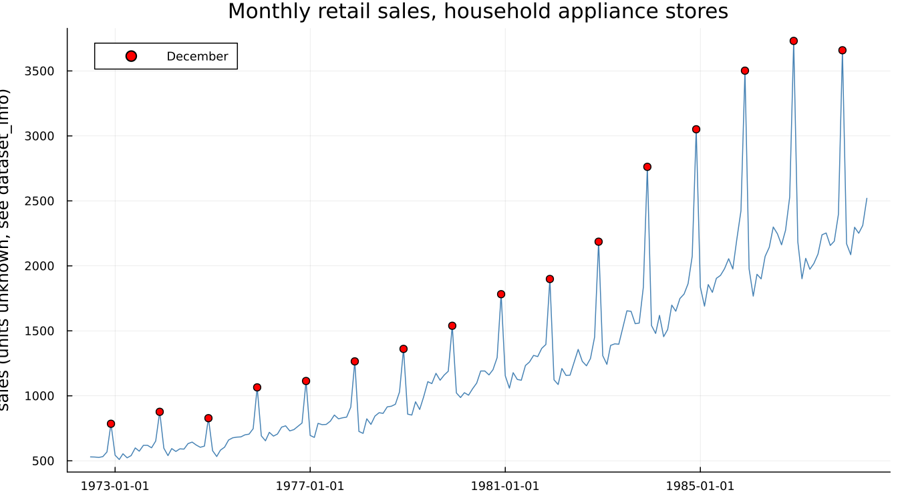

# 1. Why Adjust?

## 1.1 A number that changes every month

Retail sales at household appliance stores rose 52% from November to
December, on average, across sixteen years of Census Bureau data:

Is that good news? No — December is always like this. Every red dot in the
figure above is a December, and every one of them sits near the top of
that year's swing. A raw month-over-month comparison here answers a
question nobody was actually asking. The real question — is the
underlying level of business improving or declining — is invisible in
this chart until the seasonal pattern is removed from it.

## 1.2 Why not just compare with last year?

The obvious workaround, and the one most people reach for without being
taught to, is year-over-year comparison: this December against last
December, this March against last March. It deserves a fair hearing,
because it does solve the immediate problem — comparing like with like,
calendar position for calendar position.

It also costs more than it first appears to:

- **It discards eleven months of information** to produce one comparison,
  every time.
- **It is contaminated by whatever happened in the same month last year.**
  One unusual November — a storm, a one-off promotion, a data error —
  pollutes twelve subsequent year-over-year comparisons, once for every
  month that gets compared back against it.
- **It cannot detect a turning point until up to a year after it
  happens.** This is the decisive argument, and it is underused. A series
  that genuinely turns downward in March keeps showing positive
  year-over-year growth for months afterward, for the simple reason that
  it is still being compared against a base month from before the turn.
  By the time the year-over-year comparison catches up, a year has
  already been lost.

Seasonal adjustment exists so that *adjacent* months can be compared
directly — this month against last month, without a twelve-month wait and
without discarding eleven-twelfths of the data to get there. That is the
whole value proposition, and it is worth stating this plainly, because it
is rarer to see stated plainly than it should be.

## 1.3 The calendar is not only seasons

"Seasonal" suggests weather and holidays, and those are part of it, but
the calendar creates other effects with nothing to do with the season at
all. A month's trading-day composition — how many Mondays it has, how
many weekends — varies from year to year at a fixed calendar position,
and a retail series feels every extra Saturday. Part III covers this
family of effects (Chapters 10–12) in full.

The cleanest example of a calendar effect no *fixed* monthly factor can
absorb is a moving holiday — one whose date shifts across the calendar
from year to year. Diwali, observed widely across India, falls in
October in some years and November in others, and whichever effect it has
on a retail or travel series moves with it. A seasonal factor fixed to
"October" or "November" cannot follow a holiday that does not stay in
either month. Chapter 11 builds the regressor this actually needs, using
[`custom_holiday_regressor`](@ref).

## 1.4 What adjustment is not

Half a page of negative space, because it prevents a lot of confusion
later. Seasonal adjustment is:

- **not forecasting** — it describes the past and present, and says
  nothing about the future on its own (Chapter 13 covers forecasting as
  its own, separate capability, built on top of an adjustment);
- **not smoothing for its own sake** — the trend-cycle component (Chapter
  5) is smooth, but the adjusted series itself still carries the
  irregular component, on purpose;
- **not detrending** — the trend stays in an adjusted series; only the
  seasonal (and, depending on spec, calendar) component is removed;
- **not a way to make a series look nicer.**

It removes one specific, repeating, calendar-linked component and leaves
everything else — including the noise — exactly alone.

---

**See also:** Chapter 2 for what "trend," "seasonal" and "irregular" mean
precisely, and why splitting a series into them is not as settled a
question as it might sound. Chapter 11 for the Diwali regressor this
chapter's calendar-effect example builds toward.
