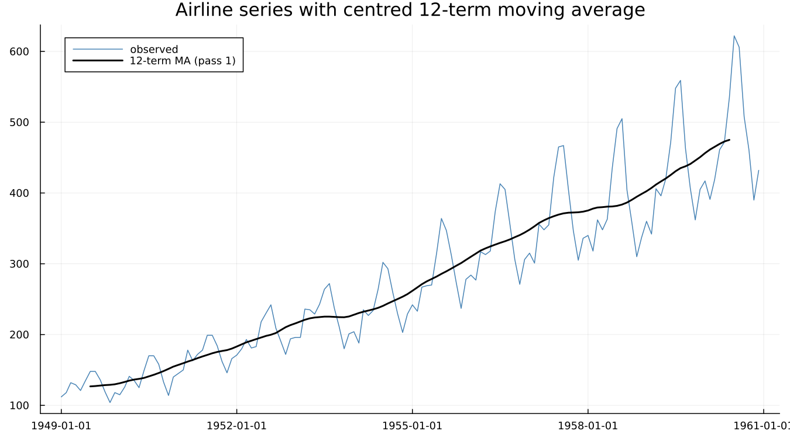
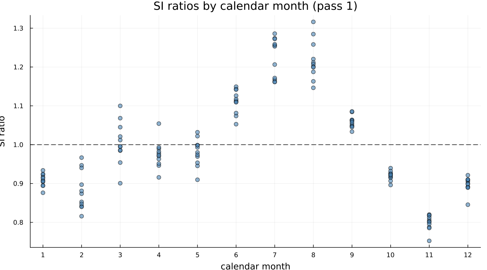
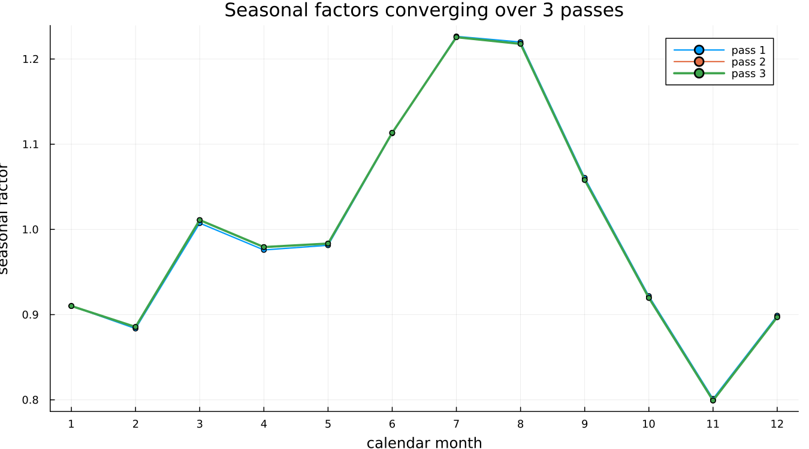

# 4. X-11 by Hand

## 4.1 The idea in four steps

Estimate the trend by moving average. Divide it out. Average what remains by
calendar month to get the seasonal pattern. Divide that out too.

That is X-11. Everything else in Part II is refinement of these four steps.

## 4.2 Implementing it

In about fifteen lines: a centred 12-term moving average for the trend, then
the ratio of the series to that trend at each point.

The moving average tracks through the seasonal swings without following
them — that is what a trend estimate is supposed to do. Dividing the series
by it at each point gives an **SI ratio**: seasonal-plus-irregular, whatever
is left once the trend is removed.

Scattered by calendar month rather than by date, a pattern appears
immediately: January and February sit consistently below 1.0, July and
August consistently above. Averaging each month's column gives a first
estimate of the seasonal factor for that month.

## 4.3 Iterating

Divide the *original* series by this first seasonal estimate, re-estimate
the trend from the result, and re-compute the SI ratios — this time as a
comparison against a trend that no longer has last pass's seasonal signal
distorting it. Repeat.

On this series the three passes are close to indistinguishable by eye,
which is itself the honest result: `airline`'s seasonal pattern is stable
and the trend estimate barely needs correcting. That is not always true —
a noisier series would show visibly more separation between the passes —
but airline converges quickly, and a toy implementation that shows three
nearly-overlapping lines is telling the truth about this particular series,
not failing to demonstrate the idea.

**A genuine trap, caught by getting it wrong first.** The natural-looking
implementation divides the *running*, already-adjusted series by the trend
at each pass, rather than the original series. That version does not
converge — it oscillates, because a series that has already had its
seasonality removed has almost none left to detect against its own smoothed
trend, so the next pass estimates a nearly flat seasonal, which — divided
back into the original series — undoes almost nothing, and the pass after
*that* rediscovers the same seasonal the first pass found. Each pass must
re-measure the full seasonal-plus-irregular signal in the *original* series
against a progressively better trend, not a shrinking residual. This is a
one-line difference in the code and a completely different behaviour.

## 4.4 The reveal

This *is* X-11 — moving-average trend, SI ratios, seasonal averaging,
iterate. Every real X-11 run does exactly this, with sixty years of
refinement on top:

| This toy | Real X-11 | Where |
|---|---|---|
| simple moving average | Henderson filter, length chosen from the data | Chapter 5 |
| mean by calendar month | a seasonal filter chosen from a family | Chapter 6 |
| three identical passes | B, C and D passes doing different jobs | Chapter 7 |
| no outlier handling | sigma limits and graduated replacement | Chapter 8 |
| multiplicative only | four decomposition modes | Chapter 8 |
| no forecast extension | a regARIMA front end | Chapter 9 |

That table is the syllabus for the rest of Part II and Part III.

**The toy above is pedagogical — inline in this chapter, not exported, and
nowhere in this package's own source.** The package itself always runs the
real Census Bureau binary; nothing here competes with it or approximates
its output. Comparing the toy's numbers directly against `x13()`'s own would
not be a fair test of either one — the differences are the entire subject of
the chapters that follow, not a discrepancy to explain away.

---

**See also:** Chapter 5 for what a real trend filter adds; Chapter 9 for why
a forecasting model sits in front of the whole procedure.
