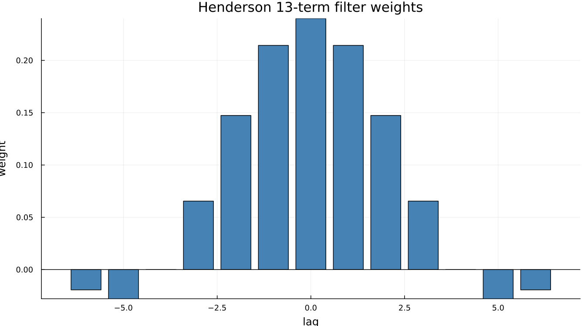
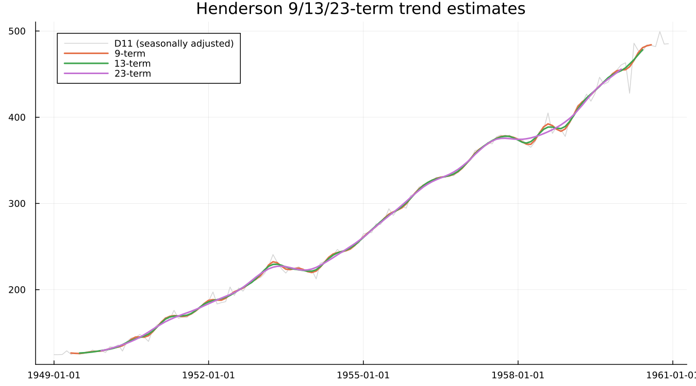
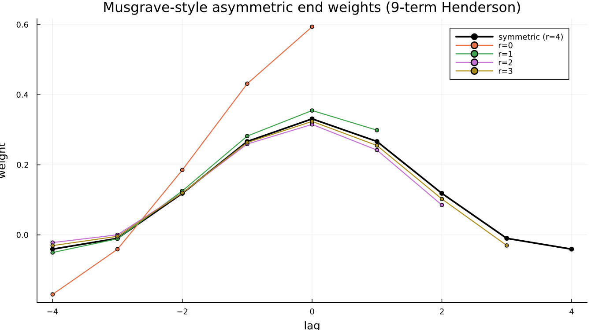

# 5. Trend Filters

## 5.1 Moving averages: the centring problem

A 12-term average of monthly data spans a whole year, which is exactly the
point — average across a full cycle and the seasonal pattern cancels out.
But twelve is even, so a plain 12-term average centred on any single month
does not exist: there is no middle point. X-11's fix is a **2×12** average —
average two consecutive 12-term averages — which centres correctly on an
observation and is what Chapter 4's toy filter actually computed.

## 5.2 Henderson's criterion

A moving average is a blunt instrument: it treats every point in its window
equally and has no opinion about the shape of the trend it is smoothing.
Henderson's filter is sharper. It is the filter — for a given odd length —
that minimises the roughness of the smoothed output (the sum of squared
third differences of the result) while still reproducing a cubic polynomial
exactly. Chosen well, it follows genuine curvature in the trend without
chasing every wiggle in the irregular.

Two things worth noticing in the shape. The weights are symmetric, and the
outermost ones are **negative**. A plain moving average cannot do that — it
can only blur a peak. A small negative weight at the edges lets a Henderson
filter *sharpen* a turning point instead, correcting for the bias a
positive-only average would introduce near curvature.

## 5.3 Length matters

Applying the 9-, 13- and 23-term Henderson filters to the same seasonally
adjusted series makes the tradeoff visible directly:

Longer means smoother and slower to react — the 23-term line cuts cleanly
through short-lived wiggles the 9-term line still follows. Neither is
"better" in the abstract; the right length depends on how much of the
short-term movement in the series is genuine signal versus irregular noise.

## 5.4 Choosing the length automatically

X-13 picks the Henderson length from the I/C ratio — how large the
irregular component is relative to the trend's own movement. A noisier
series gets a longer, more aggressively smoothing filter; a cleaner one
keeps a shorter, more responsive filter. For `airline`, [`filters`](@ref)
reports the choice directly rather than requiring it to be inferred:
`trend_ma = 9`. Read it back this way, not assumed, since the same series
under a different spec can select a different length.

## 5.5 The ends

The filters above are all symmetric — they need observations on both sides
of the point being estimated. At the two ends of any real series, half of
that window does not exist yet, and X-13 substitutes an asymmetric filter
built from the same Henderson criterion, using only the data that is
actually available:

As fewer future points are available (`r` falling from 4 toward 0), the
filter concentrates progressively more weight on the most recent observed
point rather than spreading it symmetrically. This is Chapter 9's entire
subject — the asymmetric filter is a reasonable substitute for the
symmetric one, not a flawed approximation of it, and the two figures there
show exactly what it costs and what forecast extension buys back.

!!! details "Under the hood — Musgrave's asymmetric weights, and an honest limit"
    The weights shown above are a transparent reconstruction of Musgrave's
    (1964) underlying idea, not a byte-exact reproduction of X-13's own
    internal computation: among all filters supported on the available lags
    that still reproduce a local linear trend exactly, find the one closest
    in squared distance to the symmetric Henderson weights truncated to the
    same support. No output table this package can read back exposes X-13's
    actual applied end-filter coefficients, so an exact comparison is not
    possible with what is available — a real, stated limit rather than a
    silently assumed match. What *is* verified directly: the weights sum to
    1 (preserving the series' level) and grow more skewed toward the most
    recent point as fewer future observations remain, which is the
    qualitative shape every source describes. Ladiray & Quenneville give the
    full Musgrave derivation this reconstruction is built in the spirit of.

---

**See also:** Chapter 4 for why a Henderson filter is a refinement of, not a
replacement for, the plain moving average. Chapter 9 for what the asymmetric
filters cost in practice, with real numbers.
