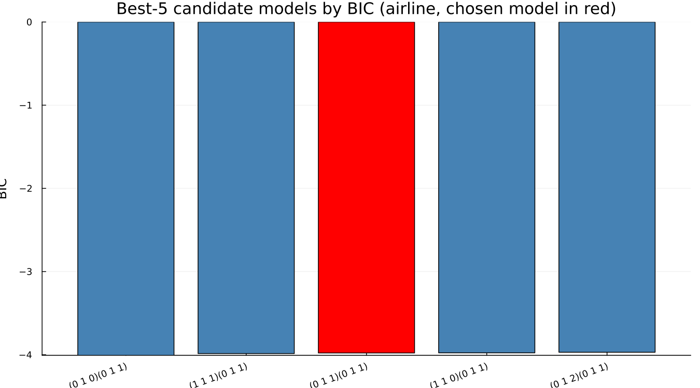
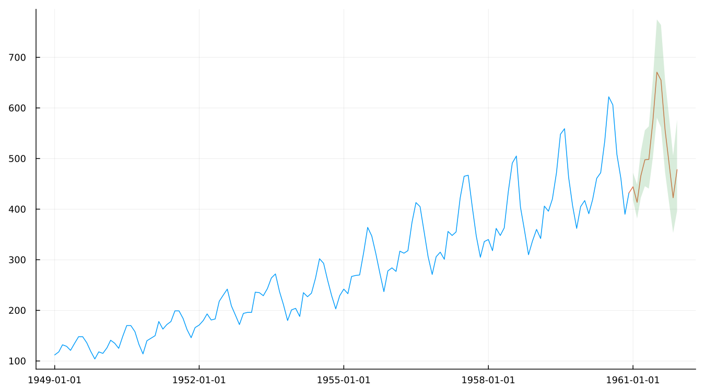

# 13. Model Selection and Forecasts

## 13.1 How automdl chooses

`automdl` is often assumed to simply pick whichever candidate model
minimises an information criterion. On the canonical airline spec, the
five candidates `automdl` actually considered say otherwise:



```
1. (0 1 0)(0 1 1)   BIC -4.007   <- best BIC
2. (1 1 1)(0 1 1)   BIC -3.986
3. (0 1 1)(0 1 1)   BIC -3.979   <- the model actually chosen
4. (1 1 0)(0 1 1)   BIC -3.977
5. (0 1 2)(0 1 1)   BIC -3.970
```

**The chosen model ranks third, not first.** `(0 1 0)(0 1 1)` has the
best raw BIC and is not what `automdl` settled on. The best-BIC candidate
is identified at an early stage and then can be rejected downstream,
after estimation and further diagnostic checking — `fivebestmdl` exists
specifically to show what was *considered*, not only what won, and this
is exactly why. It is worth noticing, too, that all five candidates sit
within 0.04 of each other: with a spread this narrow, treating the
specific ranking as decisive would overstate how confidently the data
distinguishes between them.

The model X-13 lands on, `(0 1 1)(0 1 1)`, is the same order Box and
Jenkins fitted to this exact series by hand in 1976. X-13's automatic
procedure arrives at it independently, by a completely different route.

!!! warning "Gotcha — information criteria need matching differencing orders"
    BIC values are only comparable across models fit to the *same*
    differenced data. `fivebestmdl`'s own candidate list holds the
    regular and seasonal differencing orders (`d` and `D`) fixed across
    all five for exactly this reason — comparing a BIC computed after one
    differencing order against a BIC computed after a different one is
    not a meaningful comparison, whatever the two numbers happen to say.

## 13.2 Forecasts

Chapter 9 used forecasts as a means to a better trend filter. Here they
are the point:



[`forecast`](@ref) and [`forecastplot`](@ref) both work directly off a
fitted spec — `level` controls the prediction interval width, and
changing it forces a re-run, since the interval is computed by the
binary itself rather than derived afterward from a fixed model.

## 13.3 Freezing the choice

An automatically selected specification is a moving target: re-run the
same automatic spec after a new month of data arrives, and `automdl`,
`outlier` and `aictest` are all free to choose differently than they did
last time — a different ARIMA order, a different outlier list, even a
different transform. [`static`](@ref) resolves an automatic spec's
choices into an explicit, fixed one, exactly as Getting Started chapter 4
first introduced. Publishing from a frozen, static specification rather
than re-running the fully automatic one every period is precisely what
keeps a published series' methodology from silently drifting underneath
it — Chapter 20 returns to this same idea, formally, as one of the real
levers available when an adjustment turns out to be unstable.

---

**See also:** Getting Started chapter 4 for `static()`'s original
introduction. Chapter 9 for forecasts used as a means rather than an end.
Chapter 20 for freezing a specification as a stability lever.
