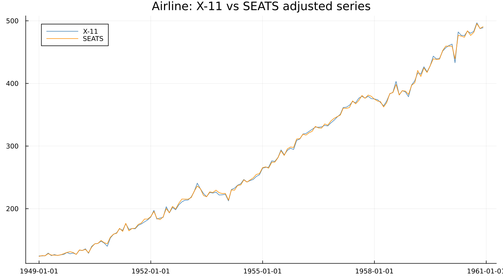
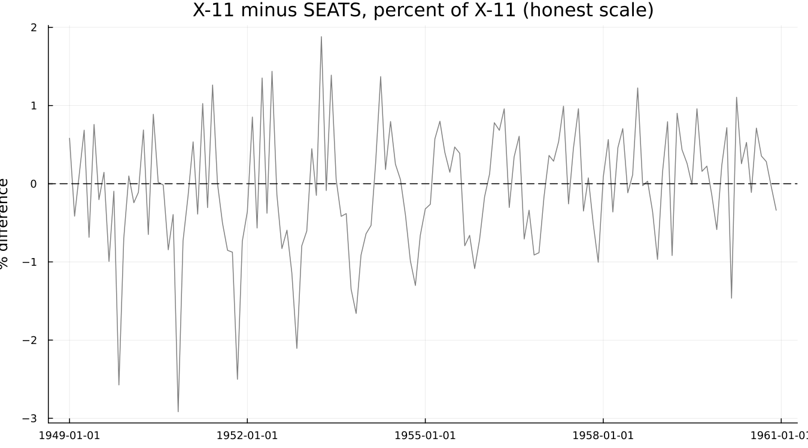
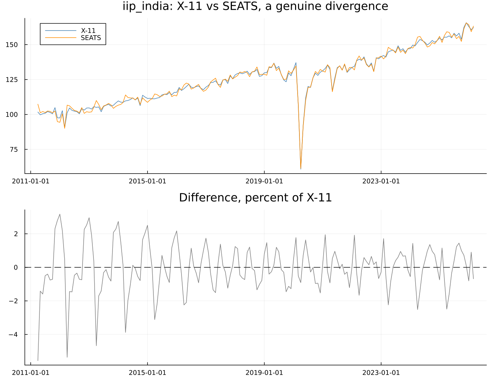

# 15. X-11 and SEATS Compared

## The realisation that gives this chapter a spine

The obvious way to compare two adjustments is the diagnostic scorecard
from Part V. **That does not work here.** M1–M11 and Q are X-11
constructs, and [`mstats`](@ref) returns `nothing` for a SEATS run —
confirmed directly, not assumed. [`filters`](@ref) does too, in its own
way: `trend_ma` comes back `nothing` and `seasonal_ma` an empty list,
because SEATS has no filter family for those fields to describe at all.

That looks like an obstacle, and it is actually the chapter's most
interesting point: **there is no common quality score between the two
methods.** The field's single most-quoted summary statistic cannot
arbitrate between the field's two rival methods.

What *does* apply to both, checked directly against a real SEATS run
rather than assumed from the X-11 case:

| Diagnostic | Works for SEATS | Confirmed |
|---|---|---|
| [`qs`](@ref) | yes | real statistics returned for original/sa/irregular/residual |
| [`spectral_peaks`](@ref) | yes | real peak flags returned |
| [`residual_diagnostics`](@ref) | yes | regARIMA is shared by both engines |
| [`mstats`](@ref) | **no** | X-11 construct; returns `nothing` |
| [`filters`](@ref) | **no**, mostly | `trend_ma=nothing`, `seasonal_ma=[]`; SEATS has no filter family |
| [`seasonality_tests`](@ref) | **no** | a real correction to this chapter's own original plan — it needs the `f2.fsb1` key from X-11's own D8 stable-seasonality F-test, which a SEATS-only run never produces |

The comparison is made on residual seasonality and spectral evidence,
not on Q or the F-tests — a genuine methodological constraint, not an
oversight of this package.

## 15.1 Same series, both engines

`airline` through both:

The difference, at an honest scale — not stretched to look more dramatic
than it is:

A small, oscillating difference throughout, averaging 0.6% and peaking
under 3% — the two methods agree closely on this series. If they had
agreed even more closely, the figure would show that plainly; the point
of drawing it honestly-scaled is that the reader sees what actually
happened either way.

Note that the components arrive under different table names — X-11's
D10–D13 against SEATS' S10–S18 — but both are reachable through
[`series`](@ref) the same way.

## 15.2 Judging them without a common score

Run [`qs`](@ref), [`spectral_peaks`](@ref) and
[`residual_diagnostics`](@ref) on both outputs and compare — this is
genuinely possible, unlike the M-statistic route. The honest observation
from the table above stands: there is no single number that adjudicates
between the two engines the way Q was hoped to.

This connects directly back to Part V. Chapter 16 argued the diagnostic
battery exists because the decomposition itself is not identified. Here
is that argument in its sharpest form yet: two methods, two different
conventions for resolving the same fundamental ambiguity, and no test
that says which convention was right.

## 15.3 Where they diverge

A genuinely divergent case did not need to be designed — it turned up by
actually running every bundled dataset through both engines and
comparing. `iip_india` shows it clearly:

The disagreement is largest — over 5% — in the first two years of the
series, and settles into a smaller, persistent oscillation afterward.
That pattern is worth noticing rather than glossing over: **it is
largest at an edge of the series**, the same structural problem Chapter
9 built an entire chapter around, here showing up as a disagreement
between methods rather than a within-method revision. Both engines
handle the interior of a long series confidently; both are less certain
near an edge, and here they resolve that uncertainty differently from
each other. Interestingly, the two engines track each other closely
straight through the series' own dramatic COVID-era shock in 2020 — the
outlier itself is large enough that both regARIMA-based front ends
absorb it in much the same way, and the disagreement is concentrated
elsewhere.

## 15.4 Which should you use

- Most of the time, on most series, the two agree closely enough that
  the choice does not materially matter — `airline` above is the
  ordinary case, not the exception.
- SEATS is the natural choice where the ARIMA model is a genuinely good
  description of the series and a coherent statistical framework matters
  for its own sake.
- X-11 is more robust when the fitted model is a poor description of the
  series, and it always produces an answer — SEATS, per Chapter 14's own
  §14.4, sometimes cannot.
- In practice, institutional convention decides most of the time, and
  there is nothing wrong with that: Chapter 3 already noted that Europe
  largely adopted SEATS while the U.S. kept X-11, a split driven as much
  by history and tooling as by a series-by-series statistical argument.

!!! info "In official statistics"
    European statistical offices largely adopted TRAMO/SEATS; the United
    States and several other countries kept the X-11 tradition.
    JDemetra+ (widely used across European statistical offices) and
    X-13ARIMA-SEATS both implement the same underlying methods this
    book covers, reflecting that split in convention and tooling as much
    as in the underlying statistics.

---

**See also:** Chapter 9 for the edge-of-series argument this chapter's
own divergent case echoes from a different angle. Chapter 16 for the
non-identification argument this chapter's central finding is the
sharpest illustration of yet.
