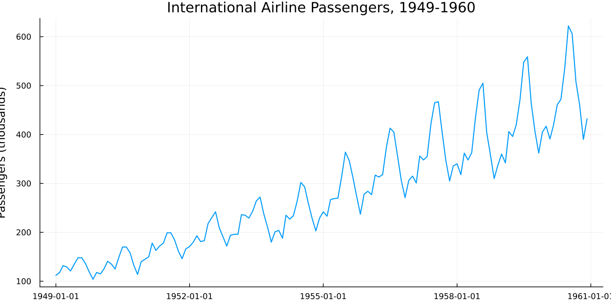
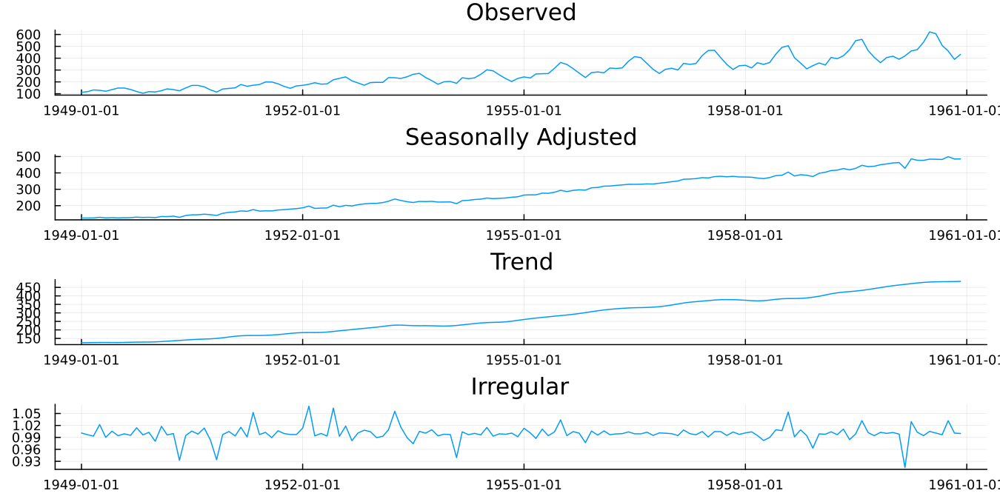

```@meta
CurrentModule = SeasonalAdjustment
```

# 2. Your First Adjustment

## The series

The package ships a few datasets, so nothing in this guide depends on
data that must first be found elsewhere.

```jldoctest
julia> using SeasonalAdjustment

julia> datasets()
4-element Vector{String}:
 "airline"
 "appliance"
 "appliance_q"
 "iip_india"
```

The first of these is wanted here.

```jldoctest
julia> using SeasonalAdjustment

julia> d = dataset("airline");

julia> length(d.value), first(d.date), last(d.date)
(144, Dates.Date("1949-01-01"), Dates.Date("1960-12-01"))
```

Monthly totals of international airline passengers, January 1949 to
December 1960, in thousands. Box and Jenkins used it in *Time Series
Analysis: Forecasting and Control*, and it has been the standard
example ever since. It appears throughout the seasonal adjustment
literature and in this package's own verification corpus. Anyone who
has read anything at all about seasonal adjustment will have seen this
series before.

Where it came from, and whether a chart of it may be republished:

```julia
dataset_info("airline")
```

```
International airline passengers ("airline")
  Source:     Box & Jenkins (1976), Series G
  Licence:    Public domain
  Kind:       published
  Frequency:  12 (monthly)
  N:          144
  Span:       1949-01-01 .. 1960-12-01
  Units:      thousands of passengers
  Citation:   Box, G.E.P. and Jenkins, G.M. (1976). Time Series
              Analysis: Forecasting and Control. Holden-Day. Series G.
```

Every dataset carries its source, licence and citation. This is
deliberate: a figure in a paper needs an attribution line, and guessing
at one is worse than simply looking it up. `iip_india` is the one
exception worth knowing about up front — its own `dataset_info` states
plainly that its exact redistribution terms were not independently
re-verified at the time it was bundled, so kindly check
`dataset_info("iip_india")` before republishing anything built from it.

[`dataset`](@ref) returns a `NamedTuple` of `date` and `value`, which
happens to be a valid Tables.jl table. So should something else be
preferred:

```julia
using DataFrames
dataset("airline", DataFrame)
```

Any Tables.jl sink works: `DataFrame`, `TSFrame`, `Tables.rowtable`,
`Tables.matrix`, or indeed anything else that accepts a table.

The airline series makes for a good first example, in that everything
it does, it does clearly.



**Figure 2.1.** Two things are visible immediately. The series trends
upward, roughly doubling and then doubling again. And within each year
there is a repeating shape, peaking in summer, with a smaller bump in
December. The yearly shape is not constant in size, either: the summer
peak in 1960 is far larger in absolute terms than the one in 1949.

That last point turns out to matter, and section 4 returns to it in
due course.

## Adjusting it

```julia
res = x13(dataset("airline"))
```

One call, and no `start` argument required. The dataset carries its
own dates, and [`x13`](@ref) reads these to work out that the series
begins in January 1949.

For one's own data, this would instead be stated explicitly:

```julia
res = x13(y; start = (1949, 1))                # y a plain Vector, monthly
res = x13(y; start = (1990, 1), period = 4)    # quarterly
```

The result is an [`X13Result`](@ref). Four series come back, each its
own field:

| Field | X-11 table | What it is |
|---|---|---|
| `seasonally_adjusted` | D11 | the series with the seasonal pattern removed |
| `trend` | D12 | the smooth underlying trend-cycle |
| `seasonal_factors` | D10 | the estimated seasonal pattern itself |
| `irregular` | D13 | what is left over |

Plus `residuals` from the regARIMA model, and `udg`, the binary's own
diagnostics dump, which section 3 makes heavy use of.

The X-11 table names in that middle column will keep appearing
throughout. They are how the X-13 documentation, and every statistical
office, refer to these series, so the package keeps them visible
rather than hiding them behind Julia names alone.

## Looking at it

```julia
plot(res)
```


**Figure 2.2.** The original series and the adjusted one, overlaid. The
summer peaks and winter troughs are gone. What remains still rises, and
still wobbles, but the wobbles are no longer the calendar's doing.

This is the chart worth looking at first, every time. Should the
adjusted line not look like a sensible version of the original with
the yearly rhythm taken out, nothing further is worth checking just
yet.

For the components taken separately:

```julia
plot(res; panels = :components)
```



**Figure 2.3.** Observed, seasonally adjusted, trend, and irregular. The
trend panel is the adjusted series smoothed further still. The
irregular panel is what neither the trend nor the seasonal pattern
explains, and on a well-behaved series it ought to look like noise
around 1.0.

## What actually happened — and what this bare call did *not* do

It is tempting to assume the single call above did everything X-13 is
capable of doing automatically: tested the transform, searched for an
ARIMA model, checked for outliers. **It did not** — and checking that
honestly is a better first lesson than simply assuming it.

```julia
transformfunction(res), arima_model(res)
```

```
(:none, "(0 0 0)")
```

No transform was tested (`transformfunction` returns `:none`, not
because X-13 tried logs and rejected them, but because nothing of the
kind was asked for), and no real ARIMA model was fit — `(0 0 0)` is
X-13's own trivial fallback whenever neither an explicit model nor
`automdl` is requested. The adjustment shown in Figures 2.2–2.3 still
ran regardless (X-11's own filtering does not need a fitted regARIMA
model in order to decompose a series), but this bare call amounts to
the "nothing turned on" baseline, not the case of "X-13 doing its usual
automatic work."

```julia
filters(res)
```

```
(seasonal_ma = ["MSR", "MSR", "MSR", "MSR", "MSR", "MSR", "MSR", "MSR", "MSR", "MSR", "MSR", "MSR"],
 trend_ma = 9, mode = nothing, sa_mode = "multiplicative seasonal adjustment", unit_root = nothing)
```

[`filters`](@ref) reports the seasonal moving average X-11 chose for
each calendar month (its own default, `MSR`, in this case), the trend
filter length, and the decomposition mode — X-11 still defaults to a
multiplicative decomposition even though no transform was tested at
the regARIMA stage; the two are separate choices entirely. X-11
selects these from properties of the data itself rather than applying
fixed defaults, and section 4 shows how these may be overridden.

And the whole specification at once:

```julia
static(res)
```

[`static`](@ref) resolves every automatic decision into an explicit
specification — here, since nothing was automatic to begin with, it
largely just echoes the bare defaults back (`arima_model="(0 0 0)"`,
`transform` left at `:none`, no outliers to list). It becomes genuinely
useful once automatic selection is actually switched on, which is
where section 3 takes up the thread.

## Before moving on

An adjusted series is now in hand, and not a single thing about
whether it is any good has yet been checked — and, as the section
above shows, X-13 has not even been asked to do its usual automatic
work either. That is the subject of the next chapter, and it is not
optional. Seasonal adjustment fails quietly. A bad adjustment produces
a smooth, plausible-looking line that happens to be wrong, and nothing
about Figure 2.2 would give that away.
