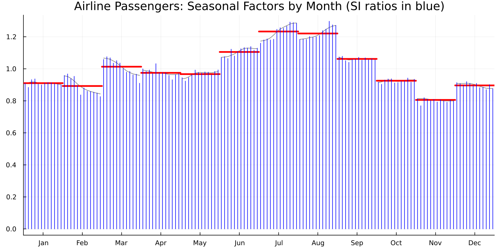
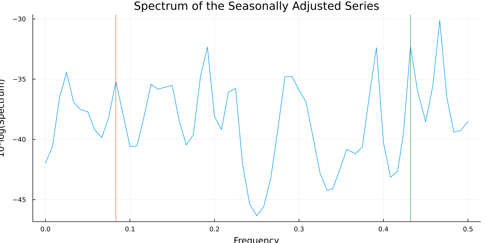
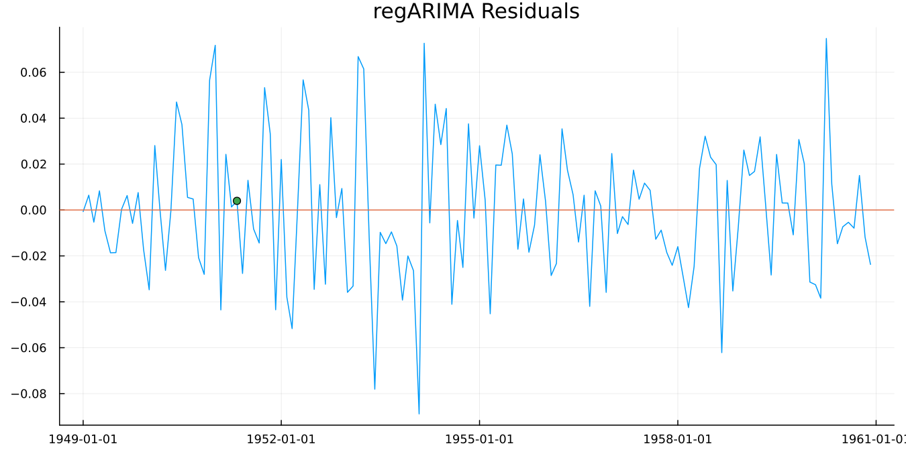

```@meta
CurrentModule = SeasonalAdjustment
```

# 3. Was It Any Good?

Seasonal adjustment fails quietly. There's no error, no warning, no
obviously wrong number. You get a smooth line that looks like an
adjusted series, and it may be wrong in ways that matter.

So there's a battery of diagnostics, and it's unusually large compared
with most statistical procedures. This chapter runs the five checks
worth making every time, in the order worth making them — against a
fuller specification than chapter 2's bare call, one that actually lets
X-13 make its usual automatic choices:

```julia
res = x13(dataset("airline");
          automdl = true,
          outlier = true,
          aictest = [:td, :easter],
          transform = :auto)
```

This is the specification behind every verified number in this chapter
and the next.

## Check 1: does the seasonal pattern look sensible?

```julia
monthplot(res)
```



**Figure 3.1.** Twelve bands, one per calendar month. The thick
horizontal bar in each band is the estimated seasonal factor. The
vertical stems are the SI ratios, which are what the data actually
showed in each individual year before smoothing.

Read it this way. The bars tell you the shape of the average year: July
and August well above 1.0, February well below. The stems tell you how
much year-to-year variation the bar is smoothing through. Tight stems
mean a stable seasonal pattern that's easy to estimate. Widely
scattered stems mean the pattern is moving, and the single bar is a
compromise.

The stems drifting steadily in one direction within a band is the
signal to watch for. It means that month's seasonal effect is changing
over time, and a single factor is hiding a trend.

## Check 2: is there seasonality left?

The point of the exercise is to remove the seasonal pattern. The QS
test asks whether any remains.

```julia
qs(res)
```

| Series | QS statistic | p-value |
|---|---|---|
| original | 167.65 | 0.000 |
| seasonally adjusted | 0.00 | 1.000 |

That's the pattern to want. Strong, highly significant seasonality in
the input. None detectable in the output.

The failure mode is a significant QS on the adjusted series. It means
the procedure didn't get everything, and the adjusted figures still
contain a calendar rhythm. On monthly economic data that's a
publication-blocking result at most statistical offices.

## Check 3: the M statistics

X-11 produces eleven summary statistics, M1 to M11, and combines them
into an overall Q. Each M targets a different way an adjustment can go
wrong: too much irregular relative to trend, seasonal factors moving
too fast, and so on.

The convention is simple. **Below 1.0 passes. Above 1.0 fails.**

```julia
m = mstats(res)
m.q, m.m7, m.fail
```

```
(0.20, 0.203, 0)
```

Q of 0.20 against a threshold of 1.0 is a comfortable pass. `fail` is
the count of individual M statistics that exceeded 1.0, and zero is
what you want.

M7 deserves separate attention. It tests whether identifiable
seasonality is present at all, and it's the one most practitioners
quote. An M7 above 1.0 is often taken to mean the series shouldn't be
seasonally adjusted, because there's not enough stable seasonality
there to remove. At 0.203, this series has plenty.

[`mstats`](@ref) returns all eleven plus `q`, `qm2` and `fail`. It
returns `nothing` for a SEATS run, since the M statistics are specific
to X-11.

## Check 4: spectral peaks

A seasonal pattern in monthly data shows up as peaks at particular
frequencies. If those peaks are still in the *adjusted* series,
seasonality survived.

```julia
spectrumplot(res; series = :sa)
```



**Figure 3.2.** The spectrum of the adjusted series, with vertical
markers at any seasonal or trading-day frequency X-13 flagged as a
visually significant peak. A clean adjustment has no markers at the
seasonal frequencies.

For a summary rather than a picture:

```julia
spectral_peaks(res)
```

[`spectral_peaks`](@ref) tells you which series show peaks.
[`spectrum_peaks`](@ref) (singular `spectrum`, note) tells you at which
frequency, which is the finer information the plot uses.

A trading-day peak is a different message from a seasonal one. It says
the series responds to the day-of-week composition of the month, and
chapter 4 shows how to model it.

## Check 5: is the model adequate?

The regARIMA model at the front of the pipeline has its own
diagnostics, and they're ordinary time series diagnostics.

```julia
residplot(res)
```



**Figure 3.3.** Residuals against time, with a zero reference line. You
are looking for something that resembles noise: no drift, no fanning
out, no runs of same-signed values.

```julia
d = residual_diagnostics(res)
d.durbin_watson, d.skewness, d.kurtosis
```

```
(1.9504, 0.0900, 3.0698)
```

Durbin-Watson near 2.0 indicates no first-order residual
autocorrelation. Skewness near 0 and kurtosis near 3 are what a normal
distribution gives, so these residuals are close to normal.

`d.ljung_box` is the full lag-indexed table rather than a single
number, because the underlying diagnostic is computed at several lags
and the answer can differ between them.

## The checklist

| Check | Function | Want |
|---|---|---|
| Sensible seasonal pattern | [`monthplot`](@ref) | tight stems, no drift within a band |
| Seasonality removed | [`qs`](@ref) | significant on original, not on adjusted |
| Overall quality | [`mstats`](@ref) | Q below 1.0, `fail` of 0 |
| No residual seasonality | [`spectral_peaks`](@ref) | no seasonal peak in `:sa` |
| Model adequate | [`residual_diagnostics`](@ref) | DW near 2, no Ljung-Box rejection |

Two more exist and are worth knowing about even though they're beyond
this guide. [`seasonality_tests`](@ref) gives the stable and moving
seasonality F-tests and the identifiable-seasonality verdict.
[`slidingspans`](@ref)/[`revision_history`](@ref) ask a different
question again: not whether the adjustment is right today, but whether
it will still look like this next month (see chapter 5).

## When a check fails

Do not reach for a different method. Reach for the specification.

A failed QS on the adjusted series, or a seasonal spectral peak,
usually means the model in front of the filter is missing something. An
outlier, a calendar effect, a level shift. Those are chapter 4.
