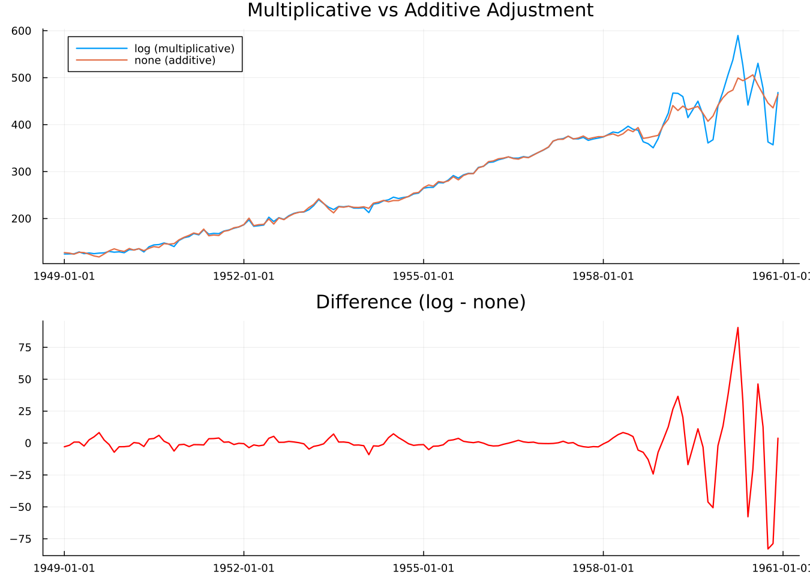
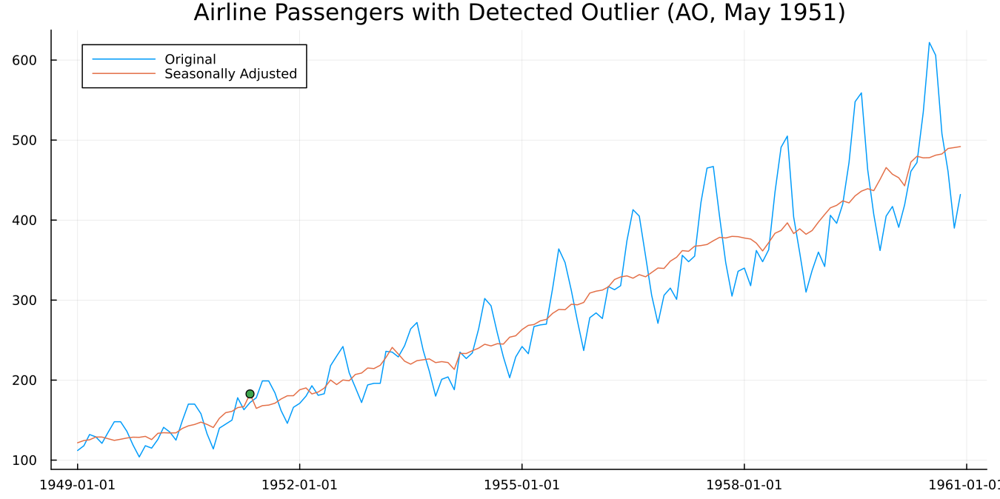

```@meta
CurrentModule = SeasonalAdjustment
```

# 4. When the Defaults Aren't Enough

Three settings account for most of what you'll ever change. This
chapter takes them one at a time and then puts them together.

## Multiplicative or additive

Look again at Figure 2.1. The summer peak in 1960 is much larger in
absolute terms than the one in 1949. But as a *proportion* of that
year's level, the two are similar. July is roughly 20% above the year's
average in both.

That distinction is the whole question. When the seasonal swing grows
with the level of the series, the pattern is multiplicative and the
model belongs in logs. When the swing stays a constant number of units
regardless of level, it's additive.

X-13 tests this for you when asked (`transform = :auto`, as in
chapter 3's `res`):

```julia
transformfunction(res)
```

```
:log
```

Log, meaning multiplicative. To see why it matters, force the other
choice:

```julia
d = dataset("airline")
res_log  = x13(d; transform = :log)
res_none = x13(d; transform = :none)
```



**Figure 4.1.** The two adjusted series, and their difference. Early in
the sample they're close. Late in the sample, where the seasonal swing
is largest, they separate. The additive version removes a
constant-sized summer effect from years where the actual effect was
much larger, and leaves visible seasonality behind.

Leave `transform` at its default unless you have a reason. The reasons
that do come up: a series containing zero or negative values cannot be
logged, and X-13 will pick `:none` for you; and if you're comparing
across a series break or reproducing someone else's published figures,
you may need to pin the choice rather than let it be re-tested each
period.

## Outliers

A strike, a policy change, a pandemic. A single unusual observation
distorts the estimated seasonal pattern for that calendar month in
*every* year, because the seasonal factor for July is estimated from
all the Julys.

Detection is off by default:

```julia
res = x13(dataset("airline"); outlier = true)
outliers(res)
```

On the airline series with the fuller specification above, one is
found:

| label | type | year | period |
|---|---|---|---|
| `AO1951.May` | `:ao` | 1951 | 5 |

An additive outlier in May 1951, one month, no lasting effect.

Worth noticing: the values around it are 163, 172, 178. **Nothing about
that looks unusual.** Detection works on regARIMA residuals after
differencing, not on levels, so it finds things the eye does not.

```julia
plot(res; outliers = true)
outlier_counts(res)
```



**Figure 4.2.** The adjustment with the detected outlier marked.

Three types are detected automatically. An **additive outlier** (AO) is
a single odd observation. A **level shift** (LS) is a permanent step to
a new level. A **temporary change** (TC) is a jump that decays back.
[`outlier_counts`](@ref) gives how many of each were found.

One caution that applies everywhere and is easy to forget. Automatic
detection near the end of a series is unreliable, because there isn't
yet enough data after the event to distinguish a temporary blip from a
permanent shift. A level shift detected in the most recent few months
should be treated as provisional.

## Calendar effects

Months contain different numbers of Mondays. A series driven by
business activity will be higher in a month with five Mondays than one
with four, and this has nothing to do with the season.

```julia
res = x13(dataset("airline"); trading = true, transform = :log)
```

Or let X-13 decide whether the effect is there at all:

```julia
res = x13(dataset("airline"); aictest = [:td, :easter], transform = :auto)
```

`aictest` fits the regressors, compares information criteria with and
without, and keeps them only if they earn their place. On the airline
series both are kept, and the trading-day F-test is emphatic:

```
F(1, 128) = 31.06,  p = 1.4e-7
```

Easter is the other built-in worth knowing. It moves between March and
April, so its effect splits across two months in a way that changes
every year, and a fixed seasonal factor cannot absorb it. `Easter[1]`
in the output means a one-day window before Easter Sunday.

X-13 has built-in regressors for Easter, Labor Day and Thanksgiving.
All three are US holidays. For Diwali, Chinese New Year, Eid, or
anything else, this package provides
[`custom_holiday_regressor`](@ref) and a calendar layer; chapter 5
points the way.

## Choosing the ARIMA model

X-13 can search for the model rather than being told one:

```julia
res = x13(dataset("airline"); automdl = true, transform = :auto)
arima_model(res)
```

```
"(0 1 1)(0 1 1)"
```

This is worth a remark. `(0 1 1)(0 1 1)` is the model Box and Jenkins
fitted to this series by hand in 1970. It's so closely associated with
it that the specification is called the *airline model*, and it
remains the default starting point for monthly economic series across
the profession. X-13's automatic procedure arrives at it independently.

To see what it considered and rejected:

```julia
fivebestmdl(res)
```

```
5-element Vector{@NamedTuple{model::String, bic::Float64}}:
 (model = "(0 1 0)(0 1 1)", bic = -4.007)
 (model = "(1 1 1)(0 1 1)", bic = -3.986)
 (model = "(0 1 1)(0 1 1)", bic = -3.979)
 (model = "(1 1 0)(0 1 1)", bic = -3.977)
 (model = "(0 1 2)(0 1 1)", bic = -3.97)
```

[`fivebestmdl`](@ref) returns the five best candidates with their BIC
values, in rank order. Useful when the chosen model surprises you
(notice `(0 1 1)(0 1 1)` isn't even the top BIC here — automdl weighs
more than raw BIC when picking among close candidates), and useful for
judging how decisive the choice was: five candidates within a hair of
each other means the selection is close to arbitrary.

If all you want is the order, without the adjustment:

```julia
select_order(dataset("airline"))
```

```
(order = (3, 1, 1), seasonal_order = (0, 1, 1, 12), transform = :none)
```

Note this is a *different* model from the one above — `select_order`
runs `automdl` on its own, with no `aictest`/`transform` requested, so
it searches under different conditions than chapter 3's fuller `res`.

## Putting it together

```julia
res = x13(dataset("airline");
          automdl = true,
          outlier = true,
          aictest = [:td, :easter],
          transform = :auto)
```

This is the specification behind every verified number in this guide
(the same one chapter 3 introduced).

The diagnostics, all independently verified against this exact call:

| Diagnostic | Value | Verdict |
|---|---|---|
| Transform | `Log(y)` | multiplicative |
| ARIMA model | `(0 1 1)(0 1 1)` | the airline model |
| Q | 0.20 | pass |
| M7 | 0.203 | identifiable seasonality |
| Failed M statistics | 0 | pass |
| QS, original | 167.65, p = 0.000 | seasonality present |
| QS, adjusted | 0.00, p = 1.000 | seasonality removed |
| Durbin-Watson | 1.95 | no residual autocorrelation |
| Outliers found | 1 (AO, May 1951) | |

## Freezing the result

Automatic selection is convenient during exploration and a liability in
production. Next month's data may change the chosen model, and your
published figures will move for reasons that have nothing to do with
the economy.

```julia
frozen = static(res)
```

[`static`](@ref) returns a specification with every automatic choice
resolved: the ARIMA order fixed, detected outliers listed explicitly,
the transform pinned. Run that specification from then on and the model
stops moving underneath you.

One caveat the docstring covers and is worth repeating. Re-running a
frozen specification reproduces the original to about six significant
figures, not bit-identically, because estimation converges slightly
differently when a model is given rather than searched for. Compare
with `isapprox`, not `==`.

## Everything else

These settings cover most cases. The rest of what X-13 can do runs to
280 pages of Census Bureau documentation.

Some of it is reachable through named keywords, and the [API
reference](../api.md) lists them. Anything without a named keyword goes
through `spec_args`, which passes raw `"block.argument"` pairs straight
to the specification file:

```julia
res = x13(dataset("airline");
          spec_args = Dict("forecast.maxlead" => "12"))
```

That escape hatch means the package never blocks you from something
X-13 can do.
