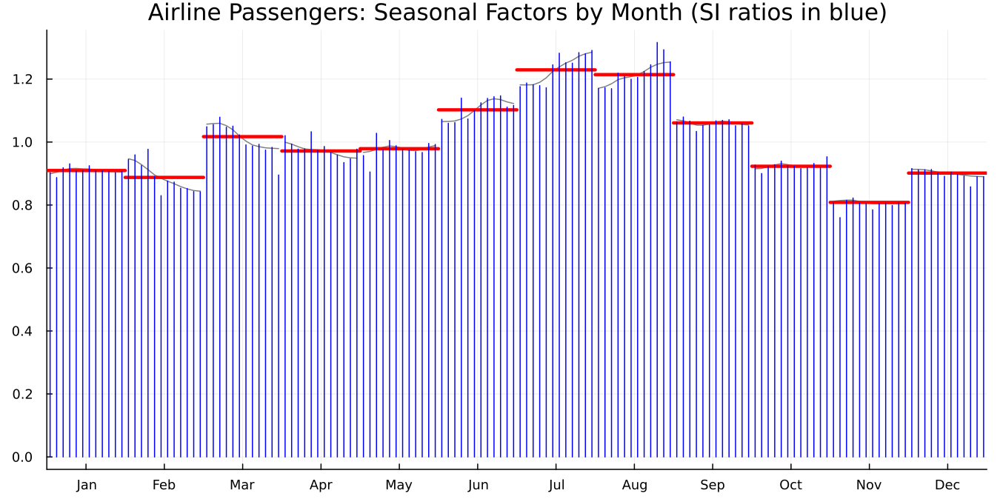
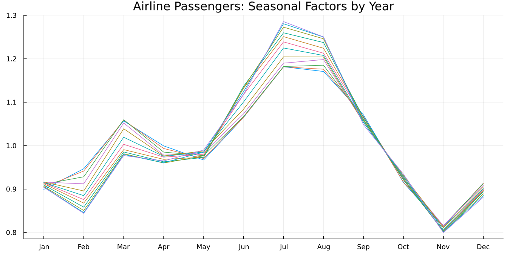
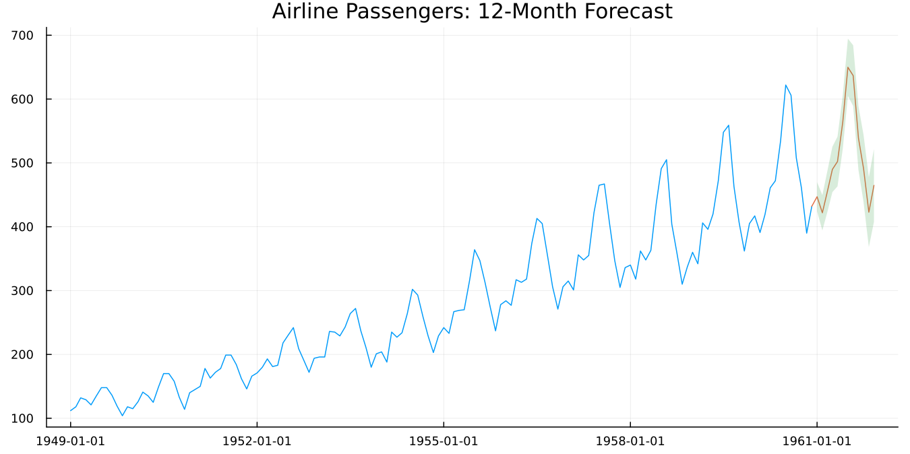
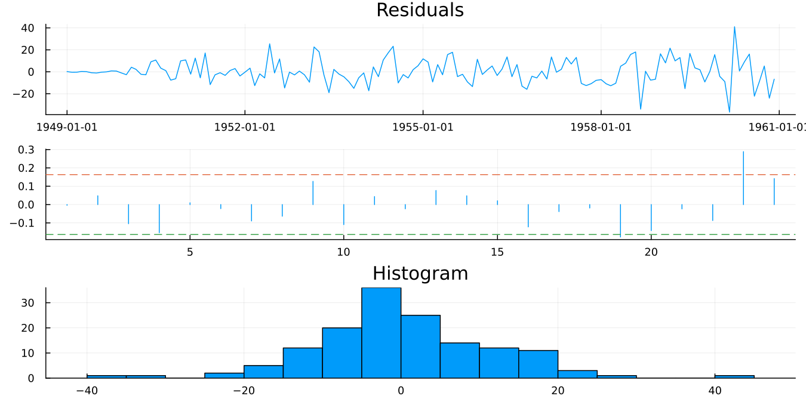
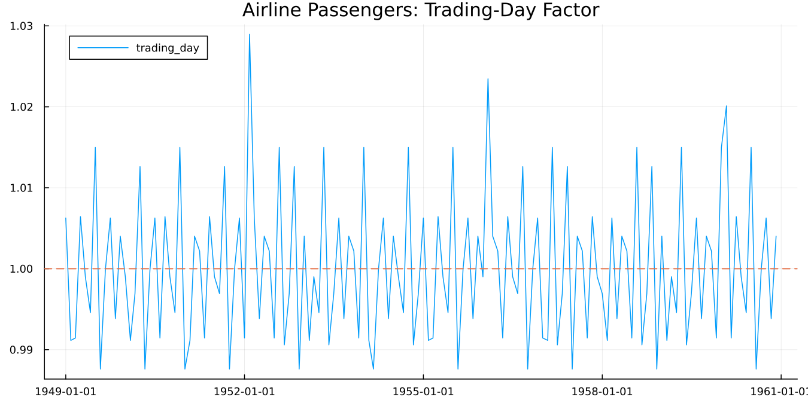
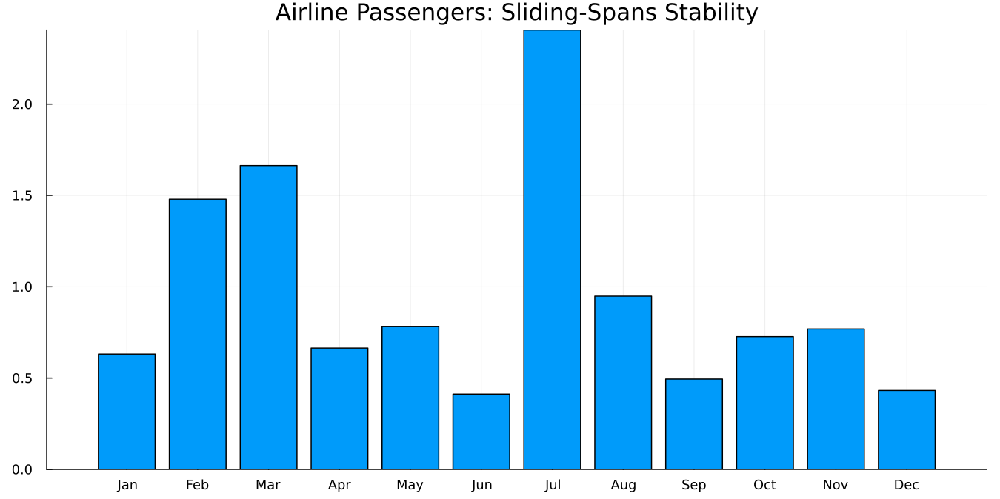

```@meta
CurrentModule = SeasonalAdjustment
```

# Getting Started

## Installation

```julia
] add https://github.com/MSALabs/SeasonalAdjustment.jl
```

The first call that actually needs the `x13prebuilt` binary
([`x13`](@ref), [`run_x13`](@ref), or [`x13_binary_path`](@ref) itself)
downloads and installs the right platform-specific artifact
automatically (Julia's `LazyArtifacts` system) — nothing to configure
by hand.

!!! note "About the examples on this page"
    Every example below was actually run, not just written and assumed
    correct — the pure-Julia ones (calendars, spec construction) are
    live `jldoctest` blocks Documenter re-verifies on every docs build;
    the ones that call the real binary were confirmed directly against
    it during development (see `development-sequence.md`'s W.0-W.4
    rows for the exact values and how each was produced) but are shown
    as plain code blocks rather than live doctests, since running the
    actual `x13prebuilt` binary isn't something every environment that
    might build these docs can do.

## Bundled datasets

Four real example datasets ship with the package (`data/*.csv`, plain
committed CSV, ~30 KB total — no download, no `Artifacts.toml` entry;
see `data/DATASETS.md` for full provenance). [`dataset`](@ref) returns a
plain `(date=, value=)` NamedTuple [`x13`](@ref) accepts directly,
inferring `start` from the dates automatically:

```jldoctest
julia> using SeasonalAdjustment

julia> datasets()
4-element Vector{String}:
 "airline"
 "appliance"
 "appliance_q"
 "iip_india"

julia> d = dataset("airline");

julia> length(d.value)
144
```

`airline` is Box & Jenkins' Series G, the standard benchmark in this
entire field — this package's own verification baseline, so it's used
throughout the rest of this page.

## A first seasonal adjustment

[`x13`](@ref) accepts anything `tsvalues` does — a plain
`Vector`, [`dataset`](@ref)'s own `NamedTuple`, or any other container
from the wider TSAnalytics.jl-style ecosystem.

```julia
using SeasonalAdjustment

# This exact call reproduces the real x13prebuilt binary's own
# D10/D11/D12/D13 output exactly, confirmed directly during this
# project's development -- start is inferred from dataset("airline")'s
# own dates, no need to pass it explicitly.
result = x13(dataset("airline"))

result.seasonally_adjusted   # the D11 table
result.trend                 # D12
result.seasonal_factors      # D10
result.irregular              # D13
result.dates                  # Date.(1949-01-01, 1949-02-01, ...)
```

Prefer SEATS's ARIMA-model-based decomposition instead of X-11's
non-parametric filters? Pass `seats=true` — everything else about the
call, and the shape of the returned [`X13Result`](@ref), stays the
same:

```julia
result = x13(dataset("airline"); seats=true, transform=:auto,
             aictest=[:td, :easter], automdl=true)
```

## A genuine superset of R's and Python's own APIs

R's `seas()` passes any spec argument through dynamically; Python's
`x13_arima_analysis()` exposes only a curated subset. [`x13`](@ref)
combines both in one call — Python-style curated options for
discoverability, R-style raw passthrough for anything they don't cover:

```julia
result = x13(
    dataset("airline");
    maxorder = (2, 1), maxdiff = (2, 1),   # Python-style curated ergonomics, matches
                                             # statsmodels' own parameter names directly
    trading = true,                         # shorthand for a trading-day regressor
    regression_variables = ["easter[1]"],  # R-style raw passthrough, for anything not curated
    transform = :log,                       # required whenever a regression block is present
                                             # (X-13's own implicit default x11 mode is
                                             # multiplicative -- confirmed directly, see
                                             # validate!'s own docstring)
)
```

A spec that would fail against the real binary is caught immediately,
before any subprocess is ever spawned:

```jldoctest
julia> using SeasonalAdjustment

julia> x13(collect(1.0:24.0))   # x13prebuilt itself requires >= 36 months (3 complete years)
ERROR: ArgumentError: series has 24 observations, but x13prebuilt requires at least 36 months (3 complete years) of data -- confirmed directly against the real binary's own error (identical wording for both period=12 and period=4, just scaled): "Series to be modelled and/or seasonally adjusted must have at least 3 complete years of data."
[...]
```

## Monthly and quarterly series

X-13ARIMA-SEATS accepts exactly two seasonal periods — `period=12`
(monthly, the default) and `period=4` (quarterly) — confirmed directly
against the real binary's own error when anything else is tried
(`"Seasonal period must be 4 or 12 if a seasonal adjustment is done"`).
`start`'s second element is a subperiod in `1:period` (a quarter number
1-4, not a month, when `period=4`); output tables/residuals are parsed
back the same way (`YYYYQQ` instead of `YYYYMM`), and the minimum-length
requirement scales with `period` (12 quarters for quarterly, same "3
complete years" rule as monthly's 36 months):

```julia
result = x13(quarterly_gdp; start=(1990, 1), period=4, seasonal_order=(0,1,1,4))
```

**One confirmed, honest gap**: [`trading_day_regressors`](@ref)'s
quarterly output (`freq=:quarter`) always has 6 columns, matching
monthly's shape — the real binary's own quarterly `.rmx` export has a
7th "Leap Year" column that this function does not reproduce. Not an
issue for feeding a *user*-defined regressor into a spec (X-13 doesn't
require the extra column there), just not a byte-for-byte replica of
X-13's own internal quarterly `td` regressor.

## India-aware calendar effects

Neither R's nor Python's default setup feeds non-Western holiday
effects into RegARIMA out of the box. This package's [`INDIA_NSE`](@ref)
calendar and regressor-generation functions do — entirely in pure
Julia, no binary invocation needed to build the regressor data itself:

```jldoctest
julia> using SeasonalAdjustment, Dates

julia> isholiday(INDIA_NSE, Date(2025, 10, 21))  # Diwali-Laxmi Pujan 2025
true

julia> isholiday(INDIA_NSE, Date(2025, 1, 26))  # Republic Day
true

julia> isbusinessday(INDIA_NSE, Date(2025, 10, 21))  # a holiday is never also a business day
false

julia> easter_date(2025)
2025-04-20

julia> diwali_2025_date(year) = year == 2025 ? Date(2025, 10, 21) : nothing;

julia> custom_holiday_regressor(Date(2025, 9, 1), Date(2025, 12, 31), INDIA_NSE, diwali_2025_date)
4-element Vector{Float64}:
 0.0
 1.0
 0.0
 0.0
```

Feed that regressor into a spec via [`X13Spec`](@ref)'s
`regression_user` (or [`x13`](@ref)'s own passthrough of the same
keyword) — see the real, end-to-end Diwali-effect proof in
`development-sequence.md` and `handoff/verification/diwali_regressor_proof/`
for the documented value this exact mechanism reproduces against the
real binary (October 1949's seasonal factor shifting from
`0.898593816033472` to `0.753973303751993`).

A real Indian series to try this against ships with the package —
`dataset("iip_india")` (India's monthly Index of Industrial Production,
2011-04 onward, MOSPI). It also carries a genuine, dramatic COVID level
shift (April 2020 collapsing to 54.0 from March's 117.2), useful for
exercising [`outliers`](@ref)/level-shift detection on a real series
rather than a synthetic one. See `data/DATASETS.md` for the one caveat:
its exact redistribution terms were not independently re-verified when
it was bundled.

## Diagnostics: everything R's `seasonal` package exposes

`x13()` always requests the `.udg` diagnostics dump (`-S`), so every
value below is already sitting on `result` with no extra call needed —
a typed accessor layer over it (`StatsAPI` for the model-fit statistics,
plain functions for everything else) reads it back out:

```julia
result = x13(dataset("airline"); automdl=true, outlier=true,
             transform=:auto, aictest=[:td, :easter])

using StatsAPI
StatsAPI.aic(result)          # 946.662093458382
StatsAPI.bic(result)          # 963.913277397589
arima_model(result)           # "(0 1 1)(0 1 1)"
transformfunction(result)     # :log

qs(result).sa                 # (statistic = 0.0, pvalue = 1.0) -- no residual seasonality left
outliers(result; full=true)   # [(label="AO1951.May", type=:ao, year=1951, period=5,
                               #   estimate=0.100155824411322, stderror=0.0204386646810968, tstat=4.9003...)]

series(result, :d8)           # re-runs automatically if :d8 wasn't already saved
```

Any spec block without a dedicated keyword (`forecast`, `slidingspans`,
`history`, ...) is reachable via `X13Spec`'s own `spec_args`:

```julia
result = x13(dataset("airline");
             spec_args = Dict("forecast.maxlead" => "0"))
```

## Plotting

Load a plotting backend (`Plots.jl` below; a Makie backend works too —
[`RecipesBase.jl`](https://github.com/JuliaPlots/RecipesBase.jl) itself
adds zero dependencies of its own) and [`x13`](@ref)'s own result plots
directly:

```julia
using SeasonalAdjustment, Plots

result = x13(dataset("airline"))
plot(result; title="Airline Passengers: Original vs Seasonally Adjusted")
```


[`monthplot`](@ref) is the one with the real diagnostic content — the
seasonal factor for each calendar month (thick gray line + red mean
bar) with the underlying SI ratios overlaid as blue stems, so you can
see the scatter the mean bar is actually smoothing through, not just
its final value:

```julia
monthplot(result; title="Airline Passengers: Seasonal Factors by Month (SI ratios in blue)")
```



[`residplot`](@ref) (regARIMA residuals) and [`spectrumplot`](@ref)
(spectral peaks — a chart neither R's `seasonal` nor Python's
`statsmodels` ships at all) round out the set; see the
[API reference](api.md) for their full keyword options.

Five more recipes (W.8) build on the accessors below. [`seasonalplot`](@ref)
is `monthplot`'s transpose — one line per calendar year, so a drifting
seasonal pattern (later years' summer peaks running higher, here) is
visible at a glance, another chart neither reference package ships:

```julia
seasonalplot(result; title="Airline Passengers: Seasonal Factors by Year")
```



[`forecastplot`](@ref) draws the observed series, the forecast extension
joined to the last observation, and the prediction interval as a shaded
ribbon:

```julia
result12 = x13(dataset("airline"); maxlead=12)
forecastplot(result12; title="Airline Passengers: 12-Month Forecast")
```



[`residdiagplot`](@ref) is the standard residual review panel — series,
ACF (with confidence bands), and a histogram — straight from X-13's own
`.acf`/`.pcf` output, not recomputed:

```julia
residdiagplot(result)
```



[`componentplot`](@ref) is the one that closes the India-calendar loop —
[`coef`](@ref) gives a regression effect's coefficient, this shows its
month-by-month factor (a trading-day effect below; a Diwali-typed user
regressor works the same way):

```julia
result_td = x13(dataset("airline"); trading=true, transform=:log)
componentplot(result_td; which=:trading_day, title="Airline Passengers: Trading-Day Factor")
```



[`spanplot`](@ref) surfaces `slidingspans`/`revision_history`'s own
stability diagnostics — here, the per-calendar-month average absolute
seasonal-factor revision across sliding spans:

```julia
result_ss = x13(dataset("airline"); spec_args=Dict("slidingspans" => ""))
spanplot(result_ss; kind=:slidingspans, title="Airline Passengers: Sliding-Spans Stability")
```



## Forecasting, missing values, and component factors (W.7)

```julia
result = x13(dataset("airline"); maxlead=12)

f = forecast(result)                    # (dates=, point=, lower=, upper=), 95% by default
f = forecast(result; level=0.99)        # re-runs -- the interval width is computed by the binary
b = backcast(result)

# X-13 interpolates a missing value via its own regARIMA estimate,
# substituting the -99999 sentinel R's na.x13() also uses:
y_with_gap = copy(dataset("airline").value); y_with_gap[20] = missing
result2 = x13(y_with_gap; start=(1949, 1), missing_action=:x13, transform=:log)
interpolated(result2)[20]               # the regARIMA-estimated replacement, not -99999

# The estimated time path of a regression effect -- coef(result) gives
# the Diwali/Easter/trading-day COEFFICIENT itself, this gives its
# month-by-month factor:
result3 = x13(dataset("airline"); trading=true, transform=:log)
components(result3; which=:trading_day)

using StatsAPI, StatsBase
StatsAPI.vcov(result3)                  # regression/ARIMA coefficient covariance matrix
StatsBase.coeftable(result3)            # Estimate / Std.Error / t value

update(result3; outlier=true)           # re-runs with one setting changed, rest preserved
```

`force`/`seasonalma` are typed [`X13Spec`](@ref)/[`x13`](@ref) keywords,
not accessors — `x13(y; force=:denton)` forces the seasonally adjusted
series' annual totals to match the original series'; `x13(y;
seasonalma=:s3x9)` picks a fixed seasonal moving-average filter instead
of X-13's own default.

## Design notes worth knowing before you dig further

- **The one deliberate exception in the TSAnalytics.jl family.** This
  package wraps the real `x13prebuilt` binary rather than reimplementing
  X-11/RegARIMA/SEATS from scratch — see [Design principles](index.md)
  on the Home page for why, and `development-sequence.md` for the full
  policy.
- **`X13Spec`/`run_x13`/`parse_output` are the lower-level API** behind
  [`x13`](@ref) — reach for them directly if you need a custom, partial
  table selection (`x13()` itself always fetches the full D10-D13/
  S10-S13 quartet) or want to inspect the rendered `.spc` text before
  running it.
- **Platform support**: Linux, Windows, and macOS are all resolved via
  [`x13_binary_path`](@ref)/[`x13_binary_available`](@ref); see
  `development-sequence.md`'s W.1 row for exactly how each platform's
  archive layout (a bare file, a zip subfolder, and a `bin/`+`lib/`
  directory pair, respectively) was confirmed and handled.
