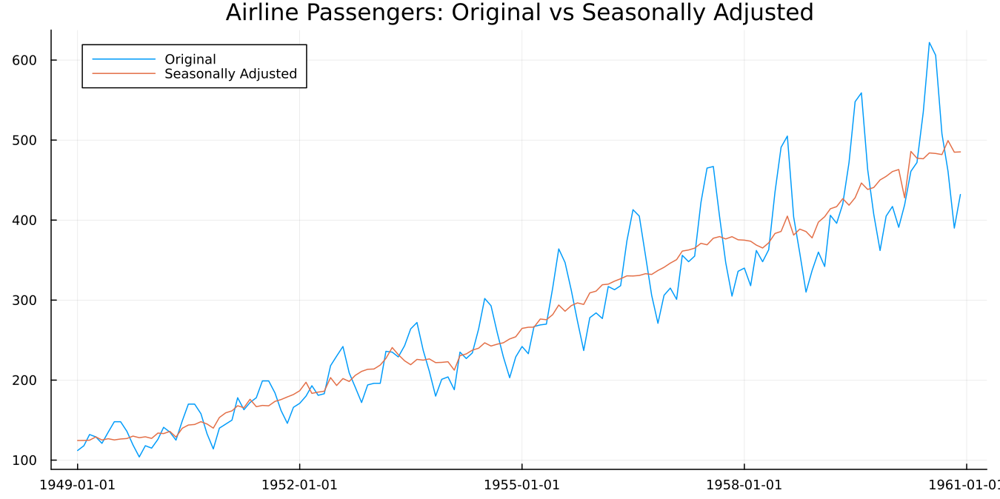

```@meta
CurrentModule = SeasonalAdjustment
```

# SeasonalAdjustment.jl

## What is SeasonalAdjustment.jl?

[SeasonalAdjustment.jl](https://github.com/MSALabs/SeasonalAdjustment.jl)
is a Julia interface to
[X-13ARIMA-SEATS](https://www.census.gov/data/software/x13as.html), the
seasonal adjustment program developed and maintained by the U.S. Census
Bureau.

Monthly and quarterly economic data carry a repeating calendar pattern.
Retail sales rise every December; industrial output falls around
Diwali. Seasonal adjustment removes that pattern so adjacent periods can
be compared, which is what makes "output rose this month" a meaningful
statement rather than a restatement of the calendar.

```julia
julia> using SeasonalAdjustment, Plots

julia> res = x13(dataset("airline"))
X13Result: 144 observations, 1949-01 to 1960-12
  transform: log      model: (0 1 1)(0 1 1)      mode: multiplicative

julia> plot(res)
```



The package builds X-13's specification file, runs the Census binary,
and parses what comes back into Julia types. **It does not reimplement
seasonal adjustment.** When you compare results against R, against
Python, or against a statistical office's published figures, you are
comparing against the same computation rather than an independent one
that happens to agree.

!!! tip "No separate X-13 download"
    Unlike the R and Python interfaces to X-13, the binary ships with
    this package as a Julia artifact, resolved for Linux, macOS and
    Windows on install. There is nothing to download from the Census
    Bureau and nothing placed on your `PATH`. Check it with
    [`x13_binary_available`](@ref).

**Status:** the `x13prebuilt` wrapper (X-11, RegARIMA, SEATS,
diagnostics, plotting, bundled datasets) is complete, including a full
twenty-chapter *Introduction to Seasonal Adjustment*. A from-scratch
native Julia engine hasn't started yet.

!!! warning "Alpha release"
    Neither this package nor `TSAnalytics.jl` is in the General registry
    yet, so both must be installed together in a single call:

    ```julia
    using Pkg
    Pkg.add([
        PackageSpec(url = "https://github.com/MSALabs/TSAnalytics.jl",
                    rev = "v0.1.0-alpha.1"),
        PackageSpec(url = "https://github.com/MSALabs/SeasonalAdjustment.jl",
                    rev = "v0.1.0-alpha.1"),
    ])
    ```

    Two separate `Pkg.add` calls fail in either order. After
    registration this becomes `Pkg.add("SeasonalAdjustment")`.

## Design principles

0. **Wrap the real binary, don't reimplement it — the one deliberate
   exception to the TSAnalytics.jl family's usual "reference, never
   port" rule.** Rather than reimplementing X-11/RegARIMA/SEATS from
   scratch, this package wraps `x13prebuilt` directly — the exact
   binary national statistical offices already trust for the hardest
   part of the whole problem (SEATS's spectral factorization
   especially); wrapping it directly gets correct, production-grade
   output immediately rather than spending months re-deriving the
   hardest mathematics in the field before shipping anything. A
   from-scratch native Julia engine remains a real, planned track,
   deliberately sequenced behind a working wrapper, not abandoned.
1. **A genuine superset of R's `seas()` and Python's
   `x13_arima_analysis()`, not just a naming exercise.** R exposes the
   entire X-13 spec grammar dynamically via `...`; Python exposes only
   a curated, typed subset. [`x13`](@ref)'s own keyword arguments
   combine both: R-style raw passthrough (`regression_variables`,
   `arima_model`) for anything the curated fields don't cover, layered
   with Python-style curated ergonomics (`maxorder`, `maxdiff`,
   `trading`, `outlier`, `seasonal_order`, ... — matching
   `statsmodels.tsa.x13.x13_arima_analysis`'s own real parameter
   names) for discoverability.
2. **Validated before a subprocess round-trip is ever spent.**
   [`validate!`](@ref) checks every real requirement this project
   confirmed directly against the actual binary (minimum series
   length, regressor forecast-horizon coverage, the
   `transform=:log`/multiplicative-mode interaction, the
   ARIMA-vs-`automdl` conflict) natively, in microseconds, before
   [`X13Spec`](@ref) is ever rendered and run — neither R's nor
   Python's wrapper does this validation at all.
3. **Typed results, not raw files or bare text.** [`run_x13`](@ref)
   returns a real [`X13RunResult`](@ref) (`success`, `warnings`,
   `errors` already extracted from the binary's own stdout — confirmed
   directly that the process exit code alone can't tell success from
   failure), and [`x13`](@ref) returns a typed [`X13Result`](@ref), not
   a directory of output tables the caller has to go find and parse
   themselves.
4. **Verified against the real binary directly, not a third-party
   reimplementation.** There is no independent second computation to
   cross-check against here — matching correctly means matching
   `x13prebuilt`'s own real output, so every committed verification
   fixture is real, generated output from actually running the pinned
   binary, reused as a regression fixture rather than hand-written.

## Resources for getting started

There are a few ways to get started with SeasonalAdjustment.jl:

- Read the
  [Installation and First Check](getting-started/01-installation.md)
  chapter, then work through
  [Your First Adjustment](getting-started/02-first-adjustment.md). It
  takes about an hour and ends with a checked adjustment.
- If you are new to seasonal adjustment as a subject, read
  [Why Adjust?](introduction/01-why-adjust.md) first. The *Introduction*
  is written to be readable without Julia in front of you.
- If you are migrating from R's `seasonal` or from
  `statsmodels.tsa.x13`, start with the
  [Manual's own translation page](manual/04-coming-from-r-python.md).
  Most function docstrings also name their R and Python counterparts.
- Already know what you want to do and just need the one worked call
  for it? The [Manual](manual/01-specifications.md) is organised as
  "how do I ..." tasks, not a walkthrough.

!!! tip "Help us improve"
    If you hit an unclear error message, confusing behaviour, or a gap
    in the documentation — even if you have already solved the problem —
    please open an issue on the
    [issue tracker](https://github.com/MSALabs/SeasonalAdjustment.jl/issues).
    Feedback of that kind is the most useful signal we get.

## How the documentation is structured

A high-level view of the layout will help you know where to look.

- **[Getting Started](getting-started/01-installation.md)** is a guided
  path from installation to a checked adjustment, using one dataset and
  one thread. Start here if you want to use the package.

- **[Manual](manual/01-specifications.md)** answers "how do I ...?" for
  a specific task -- specs, output tables, batch runs, calendars,
  plotting, R/Python migration -- one worked call per page, not a
  walkthrough. Start here once you know what you're trying to do.

- **[Introduction to Seasonal Adjustment](introduction/01-why-adjust.md)**
  explains the subject: what X-11 does with its three passes, why a
  forecasting model sits in front of a smoothing procedure, what SEATS
  does differently, and how to read every diagnostic. Start here if you
  want to understand what you are running.

- **[API Reference](api.md)** is the complete list of functions,
  keywords, defaults and known gaps. Look here when you want to know
  what a particular argument accepts. The other two sections
  deliberately do not repeat it.

## Citing

If you use this package in published work, please cite **both** the
package and X-13ARIMA-SEATS itself. The statistical results are the
Census Bureau's program; this package is an interface to it.

```bibtex
@software{SeasonalAdjustmentJL,
    author  = {{XKDR Forum}},
    title   = {{SeasonalAdjustment.jl}: Seasonal adjustment in Julia with X-13ARIMA-SEATS},
    year    = {2026},
    url     = {https://github.com/MSALabs/SeasonalAdjustment.jl}
}

@manual{X13ARIMASEATS,
    author       = {{U.S. Census Bureau}},
    title        = {X-13ARIMA-SEATS Reference Manual},
    organization = {U.S. Census Bureau},
    address      = {Washington, DC},
    url          = {https://www.census.gov/data/software/x13as.html}
}
```

!!! note
    The repository will move to the [xKDR](https://github.com/xKDR)
    organisation. The URL above is current as of this release; the
    citation author is not affected by the move.

Work that leans on the methodology rather than the software should also
cite Findley, Monsell, Bell, Otto and Chen (1998) for the regARIMA and
diagnostic apparatus. The
[Further Reading](introduction/B-further-reading.md) appendix has the
full list.

## About XKDR Forum

SeasonalAdjustment.jl is developed at [XKDR Forum](https://xkdr.org) —
Cross Disciplinary Knowledge Data Research — a non-profit research
organisation in Mumbai, India, whose work spans economics, law, public
administration, engineering and statistics. Building open tools for
working with Indian data is part of its applied statistics programme,
and this package is one of them.

That origin shapes the package in a way worth stating plainly. X-13's
built-in moving-holiday regressors are Easter, Labor Day and
Thanksgiving — three United States holidays — and the literature has
largely followed suit. Holidays that move between months on a lunar or
luni-solar calendar, Diwali among them, are a structurally different
problem and a poorly served one. The calendar layer in this package,
and the [Moving Holidays](introduction/11-moving-holidays.md) chapter of
the *Introduction*, exist because of that gap.

XKDR's other open-source work is at [github.com/xKDR](https://github.com/xKDR).

## License

SeasonalAdjustment.jl is licensed under the
[MIT license](https://github.com/MSALabs/SeasonalAdjustment.jl/blob/main/LICENSE).

The bundled X-13ARIMA-SEATS binary is **not** covered by that license.
It is distributed under the U.S. Census Bureau's own public-domain and
royalty-free terms; consult the
[`x13prebuilt`](https://github.com/x13org/x13prebuilt) repository for
the exact wording.
