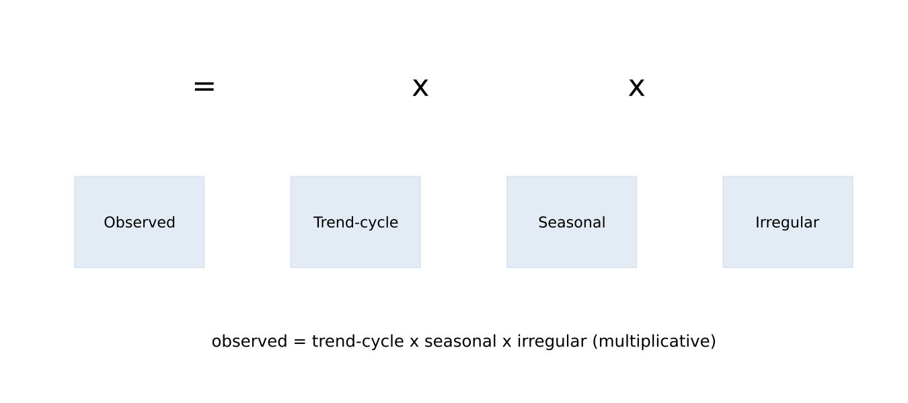
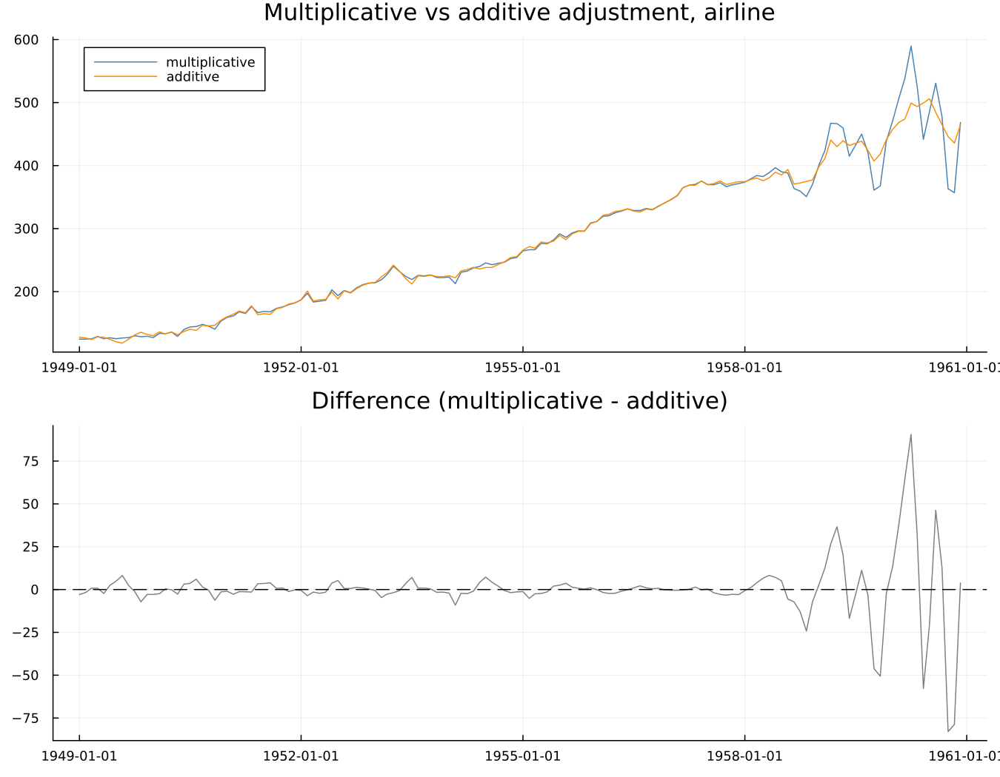
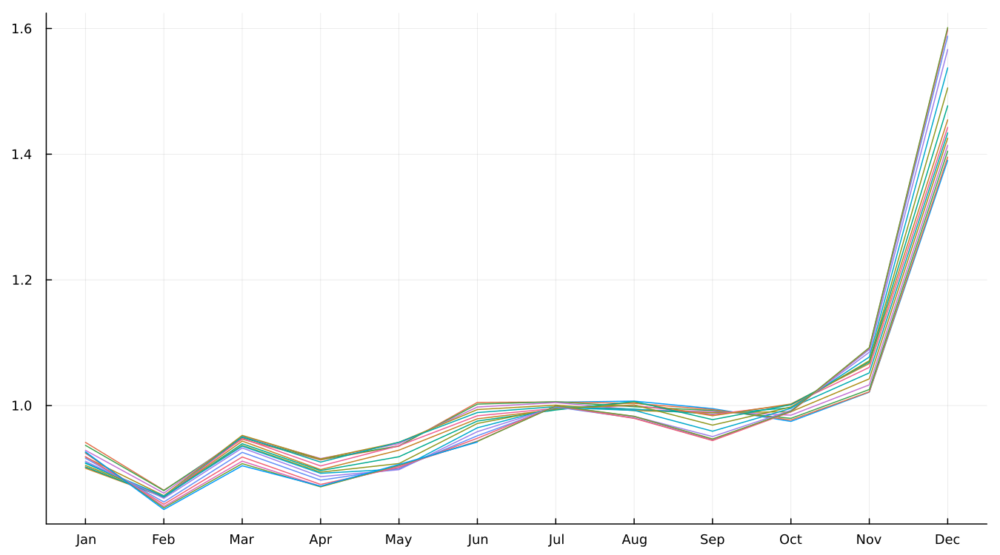

# 2. The Decomposition and Its Ambiguity

## 2.1 Three components

Every seasonal adjustment method starts from the same basic idea: an
observed series is a combination of a trend-cycle, a seasonal component,
and an irregular component.

Trend and cycle are deliberately not separated into two pieces — a single
combined trend-cycle component covers both the long-run direction of a
series and its slower business-cycle-scale movements, which surprises
readers who expect a distinct business-cycle line the way trend and
seasonal get their own lines. Separating trend from cycle cleanly is a
harder problem than seasonal adjustment itself, and it is out of scope
for what X-13 does.

## 2.2 Multiplicative or additive

When the seasonal swing grows in proportion to the level of the series,
the relationship is **multiplicative**: `observed = trend × seasonal ×
irregular`. When the swing stays a roughly fixed absolute size regardless
of level, it is **additive**: `observed = trend + seasonal + irregular`.

Run on `airline` two ways — multiplicative and additive — the two
adjustments track closely together early in the series, when the level
and the seasonal swing are both still small, and diverge sharply later,
once the level has grown enough that a proportional swing and a fixed
swing genuinely disagree about how large December's effect should be.
Chapter 8 covers the full four-mode family (multiplicative, additive,
pseudo-additive, log-additive) in depth; what matters here is narrower and
more important: **the choice between them is a modelling assumption
about the series, not a measurement extracted from it.** Nothing in the
data hands a reader the "correct" mode the way a measuring instrument
would. It is chosen, and different reasonable choices give genuinely
different answers, as the figure above shows directly.

## 2.3 Why there is no right answer

This is the chapter, and the reason Part I exists as a distinct part of
the book at all.

> Given an observed series, infinitely many trend-and-seasonal splits
> reproduce it exactly. Nothing in the data chooses between them.

State it concretely rather than abstractly. A seasonal pattern that
drifts slowly over twenty years — is that a *changing seasonal*, or is
the drift actually part of the *trend*, with the seasonal itself fixed?
Both readings reproduce the same observed series exactly; nothing about
the data itself adjudicates between them. At the other extreme: a
seasonal factor that jitters sharply from month to month — is that a
genuinely volatile seasonal pattern, or a smooth, stable seasonal plus a
large irregular that happens to look like seasonal jitter? Again, both
are consistent with what was actually observed.

**There is no data-based answer. Every method supplies a convention
instead of discovering a fact.** X-11's convention is encoded directly in
its filters: the seasonal filter's span (Chapter 6) sets how quickly the
seasonal pattern is allowed to change, and the Henderson filter's length
(Chapter 5) sets how much curvature the trend is allowed to have. SEATS'
convention comes from somewhere else entirely — the structure of a fitted
ARIMA model (Chapter 14). Two genuinely different conventions for
resolving the same fundamental ambiguity, not two implementations of one
shared idea.

This is also, directly, what a seasonal pattern changing shape over the
years looks like once decomposed:

Each line is one year's own seasonal-and-irregular shape across the
twelve calendar months. Where the lines sit close together, the seasonal
pattern has been stable; where they fan apart, it has been moving — and
Chapter 6's moving seasonality ratio (§6.4) is the formal version of
exactly that observation.

Then the sentence Chapter 16 exists to pay off:

> Because there is no true seasonal component to compare an estimate
> against, there is no test for whether a given decomposition is
> *correct*. What the field has built instead is a battery of checks,
> each targeting one specific way a decomposition can go wrong. Part V is
> that battery.

## 2.4 What "seasonal" means, operationally

The honest closing point, and the one worth carrying into every chapter
after this one: operationally, "seasonal" is whatever the chosen filters
— or the chosen model, for SEATS — call seasonal. That is uncomfortable
to sit with the first time, and it is true, and a reader who accepts it
plainly will read the rest of this book correctly. A reader who resists
it will keep expecting a single right answer the method was never built
to supply.

---

**See also:** Chapter 6 for X-11's own convention in full. Chapter 14 for
SEATS' alternative. Chapter 16 for the diagnostic battery this chapter's
central claim makes necessary.
