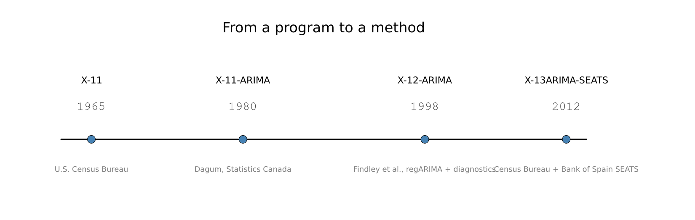
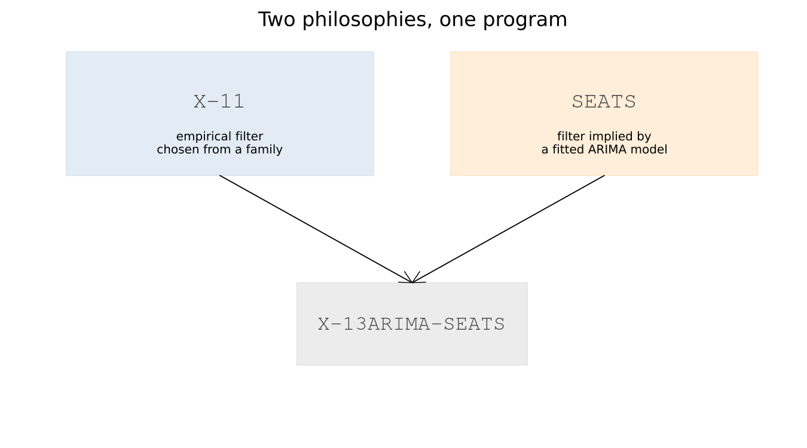

# 3. Where X-13 Came From

## 3.1 A program, not a model

Julius Shiskin, at the U.S. Census Bureau, had been working on
seasonal adjustment since 1954, and by 1965 the Census Bureau had a
program ready to publish. Julius Shiskin, Allan Young and John
Musgrave documented it as *The X-11 Variant of the Census Method II
Seasonal Adjustment Program*, Census Bureau Technical Paper No. 15 —
dated November 1965, though the paper itself was not formally
published until 1967.

The name is worth pausing on for what it says, not for a naming
story. It was published as **a program** — a specific, concrete
sequence of moving averages, chosen and refined through over a decade
of experimentation — with no underlying statistical model behind it
at all. Chapter 4's toy filter is direct evidence that this
description is literally accurate: fifteen lines of moving averages
and iteration really do produce something close to what X-11
produces, and Chapter 4's own "what the toy leaves out" table is
mostly refinements of that same basic procedure, not a different kind
of thing altogether.

That absence of an underlying model is exactly what made X-11
immediately useful in practice — it worked, and statistical agencies
adopted it — and exactly what made it a source of unease among
statisticians for the following decades. A procedure that works but
cannot be derived from a stated probability model is hard to reason
about formally, however well it performs.

## 3.2 The end-of-series problem

Chapter 9 has already made this argument in full, with real numbers,
so here it gets one paragraph rather than a second telling. X-11's
filters are symmetric everywhere except at the two ends of a series,
where the future observations a symmetric filter needs do not yet
exist — and the asymmetric substitutes used there give the most
recent, most-watched months the least reliable estimates and the
largest subsequent revisions. Estela Bee Dagum, at Statistics Canada,
published a fix in 1980: forecast the series forward with an ARIMA
model first, and only then apply the ordinary symmetric filter to the
extended data. The method was named X-11-ARIMA for precisely that
reason, and Statistics Canada issued a refined revision, X11ARIMA/88,
in 1988.

## 3.3 The model-based challenge

A separate line of research asked a more fundamental question: rather
than smoothing the observed series with a chosen filter, why not fit a
statistical model to the series and let the *model itself* determine
the decomposition? Signal-extraction methods along these lines
developed through the 1970s and 1980s, and Victor Gómez and Agustín
Maravall, at the Bank of Spain, built TRAMO/SEATS into the specific,
widely adopted implementation of that idea. Europe's statistical
offices largely adopted the model-based approach, while the United
States and several other countries retained the X-11 filter-based
tradition. Chapter 14 covers what SEATS actually does, in full.

## 3.4 Convergence

The U.S. Census Bureau's own program kept developing in parallel.
X-12-ARIMA, documented by David Findley, Brian Monsell, William Bell,
Mark Otto and Bor-Chung Chen in 1998, added the regARIMA front end in
the form Part III of this book covers — trading-day and holiday
regressors, automatic outlier detection, and most of the diagnostic
battery Part V is built around.

X-13ARIMA-SEATS, first released in July 2012, merges the two
traditions into one program rather than choosing between them:
X-12-ARIMA's own regARIMA and X-11 engine, with the Bank of Spain's
SEATS engine included as a genuine second decomposition method,
selected with `seats = true` rather than X-11's own `x11{}` block.

**Two philosophies, one program, and the diagnostic battery as the
shared ground both are judged on** — Part V applies to an X-11 run and
a SEATS run alike, and Chapter 15 uses exactly that shared ground to
compare them directly. That framing organises everything from here
on: Part II is X-11's philosophy in detail, Part IV is SEATS', Part
III is the regARIMA front end both share, and Part V is how either one
is actually checked.

!!! details "A name deliberately not repeated here"
    Popular retellings of X-11's history often add that "X-11" was
    named for being the eleventh experimental variant tried. It is a
    memorable story, and it is repeated often. It could not be
    confirmed against a primary source while writing this chapter, and
    a book that otherwise verifies its dates and attributions directly
    is not the place to repeat an anecdote on the strength of how
    often it is told. Should a primary source for it turn up, it
    belongs here; until then, it stays out.

---

**See also:** Chapter 4 for direct evidence of §3.1's "a program, not
a model" claim. Chapter 9 for the end-of-series argument only
summarised here. Chapter 14 for what SEATS actually does. Chapter 15
for the direct X-11-versus-SEATS comparison this chapter's closing
framing sets up.
