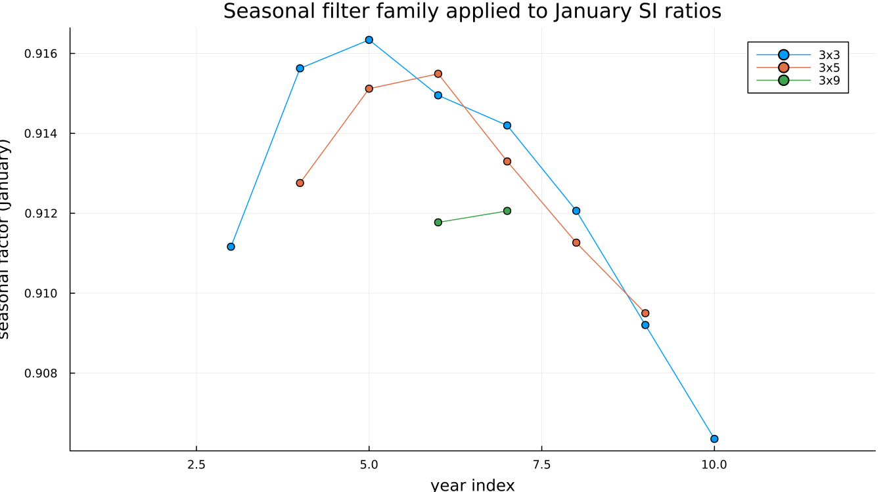
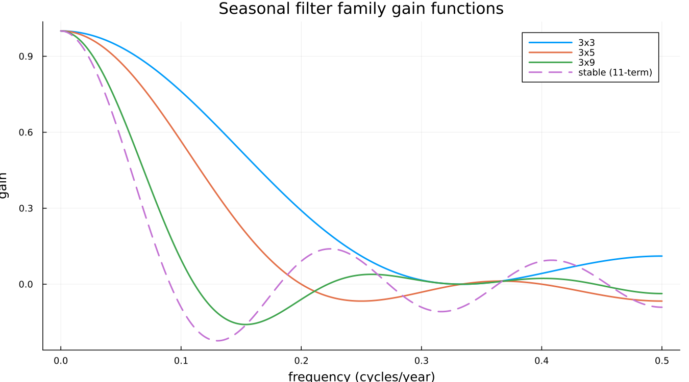
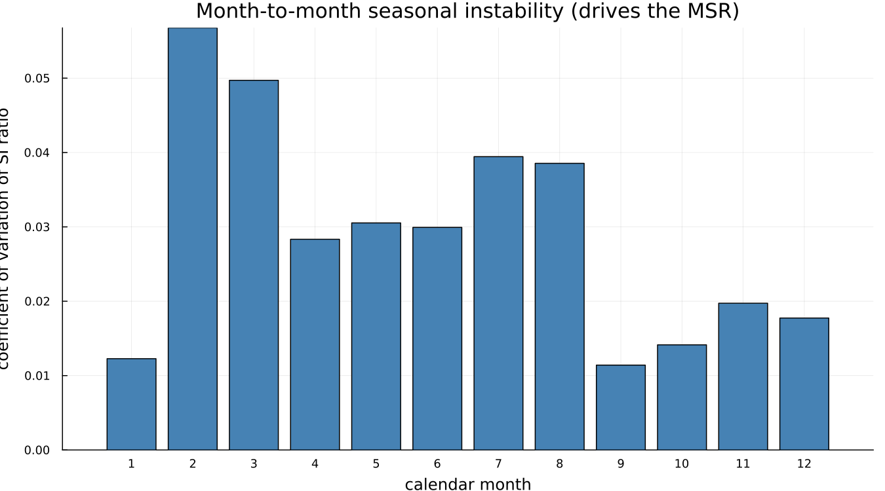

# 6. Seasonal Filters

## 6.1 Filtering across years, not along the series

This is the conceptual hurdle the rest of the chapter depends on, so
it is worth stating plainly before anything else: **the seasonal
filter does not move along the series.** It moves *across years, at a
fixed position in the calendar.* To estimate January's seasonal
factor, it looks at the SI ratio for every January in the data,
smooths *that* sequence, and produces one seasonal-factor estimate
per January. It then does the same for February, independently, and
so on.

A reader who pictures the seasonal filter sliding along the time axis
the way the trend filter does will misread everything else in this
chapter. It is exactly this layout — one calendar position at a time,
compared across years — that makes [`monthplot`](@ref) (Figure B-9,
Chapter 8) legible: each of its twelve bands *is* one of these
calendar-position subseries.

## 6.2 What 3×3, 3×5 and 3×9 mean

A "3×5" seasonal filter is a 3-term simple average of a 5-term simple
average, applied along one calendar-position subseries. The
composition gives it a span, in years, of `3 + 5 - 1 = 7`. The family
used in practice:

| Filter | Span (years) |
|---|---|
| 3×3 | 5 |
| 3×5 | 7 |
| 3×9 | 11 |
| stable | the entire series, one factor per month, never updated |

Once the name is read as "a moving average of a moving average," it
ceases to be an opaque label.

## 6.3 What each one does

Applying 3×3, 3×5 and 3×9 to the same calendar position (January) on
`airline` shows the tradeoff directly:

The 3×3 line is the most responsive of the three, and the 3×9 line —
barely visible, with only two points — is the most stable. That
sparseness is itself informative rather than a drawing error:
`airline` has twelve years of data, and an 11-year-span filter has
almost no room to move within it. On a short series, the longer
filters in this family are close to unusable, which is part of why
the filter choice needs to be made automatically rather than fixed.

**Gain functions make the same tradeoff visible in the frequency
domain,** which is the more useful view for understanding *why* a
filter behaves as it does rather than only observing that it does:

Every filter in the family passes frequency 0 with gain 1 — none of
them touch the series' overall level. What differs is how quickly
gain falls off as frequency rises: 3×3's gain stays high longest,
letting more year-to-year seasonal movement through; the stable
filter's gain collapses fastest, admitting almost nothing but the
long-run average shape. A filter is not merely "smoother" or
"rougher" in the abstract — it is a specific statement about which
frequencies of seasonal change are treated as signal and which are
treated as noise to be averaged away.

## 6.4 The moving seasonality ratio

X-13 does not leave the choice among 3×3, 3×5, 3×9 and stable to the
user by default — it measures how much the seasonal pattern actually
moves year to year relative to the irregular, and picks accordingly.
For `airline`, [`filters`](@ref) reports the outcome directly:
`seasonal_ma = "MSR"` at every calendar position, and the real `.udg`
field behind that choice, `sfmsr`, reports `3x3` — the most
responsive filter in the family, appropriate for a seasonal pattern
with genuine, if modest, year-to-year movement.

This is not the moving seasonality ratio itself — X-13's own MSR
calculation and its specific threshold cutoffs are a documented X-11
algorithm this package does not recompute — but the coefficient of
variation of each month's own SI ratios shown here embodies the same
underlying idea: some calendar months carry more year-to-year
seasonal instability than others, and it is exactly this kind of
instability, aggregated across all twelve months, that the real MSR
measures and that ultimately selected 3×3 for this series.

!!! warning "Gotcha — do not quote the MSR thresholds from memory"
    X-11's selection rule between 3×3, 3×5, 3×9 and stable has
    specific numeric cutoffs, with an "uncertain" band that triggers a
    second decision pass rather than a clean threshold crossing. Those
    cutoffs are easily stated slightly wrong from recollection. Take
    them from the Census manual's own X-11 specification documentation
    or from Ladiray & Quenneville directly, rather than restating a
    remembered version here.

---

**See also:** Chapter 8, Figure B-9, for what this layout looks like
as `monthplot`'s own SI-ratio overlay. Chapter 14 for the SEATS
alternative to choosing a filter from a fixed family at all.
