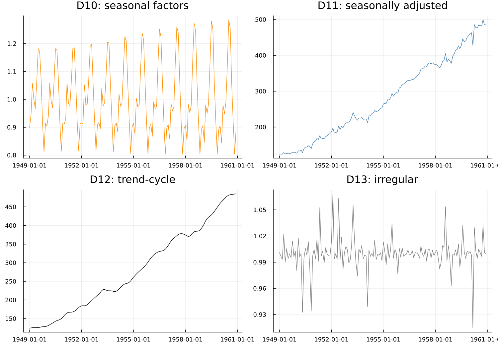

# 7. The B, C and D Tables

## 7.1 Why iterate three times

Chapter 4's toy filter ran three identical passes and watched the
seasonal estimate settle down. Real X-11 also runs multiple passes,
but they are not identical — each does a specific job, informed by
what the previous pass learned:

- **B** is the first, crude estimate — trend, SI ratios, seasonal
  factors, computed the direct way.
- **C** repeats the estimate using B's own results to identify and
  down-weight extreme values first (Chapter 8), so that the trend and
  seasonal are no longer distorted by whatever caused them.
- **D** repeats once more against the cleaned-up C-pass estimates, and
  is final.

Better information about extreme values at each stage produces a
better trend, which produces better SI ratios, which in turn produces
a better seasonal estimate — the same convergence logic Chapter 4
demonstrated directly, now split across passes that each do a
genuinely different job rather than literally repeating the same
computation.

## 7.2 The naming scheme

Every table in the B, C and D passes is named `<letter><number>` —
`B1`, `C9`, `D11`, and so on — and the numbering carries real
information rather than being arbitrary:

> Within the core block, the second digit means the same thing in
> every pass. **10** is seasonal factors, **11** is the seasonally
> adjusted series, **12** is the trend-cycle, **13** is the
> irregular. So B10, C10 and D10 are the same *quantity* at three
> successive stages of refinement, and D10 — the final pass — is the
> one actually used.

That single sentence makes a dozen table names learnable rather than
merely memorised. It holds specifically for the 10–13 block; it does
not extend to every table in every pass (there are 281 saveable
tables in total, most of them diagnostics rather than core
decomposition steps), so it should be treated as the key to the
*core* sequence, not a universal rule.
`handoff/x13-saveable-tables.md` in this project's own working
documents carries the full catalogue, should a specific table beyond
D10–D13 be needed.

`X13Result` maps the final D-pass directly onto typed fields, and
everything from here on uses those names — `result.seasonal_factors`,
`result.seasonally_adjusted`, `result.trend`, `result.irregular` —
rather than the raw table codes:

Read top-to-bottom-left-to-right and the whole method becomes legible
at once: seasonal factors, seasonally adjusted series, trend-cycle,
irregular — the last three of which, multiplied back together,
reconstruct the first exactly.

!!! warning "Gotcha — the save keyword is not the table number"
    The holiday-factor series is table **A7** in the Census Bureau's
    own numbering, but requesting it means asking for
    `regression.holiday`, and it lands on disk as `.hol`, not `.a7`.
    Only `a10` and `a13` happen to be spelled as their own table
    numbers. This is a real trap, not a hypothetical one — it produced
    a genuinely wrong table-availability analysis once during this
    package's own development, caught only by checking against the
    real binary's actual file output rather than the Reference
    Manual's table listing alone.

## 7.3 Where to look things up

D10–D13 is a small, memorable core. The other 277 saveable tables —
every diagnostic, every intermediate step, every SEATS-side
equivalent — are not worth memorising, and this book does not
attempt it. [`series`](@ref) fetches any of them by symbol once the
name is known; `handoff/x13-saveable-tables.md` is where the name may
be found.

---

**See also:** Chapter 8 for what the B-to-C step's extreme-value
handling actually does. Chapter 9 for the asymmetric-filter problem
that applies identically inside every one of these passes.
