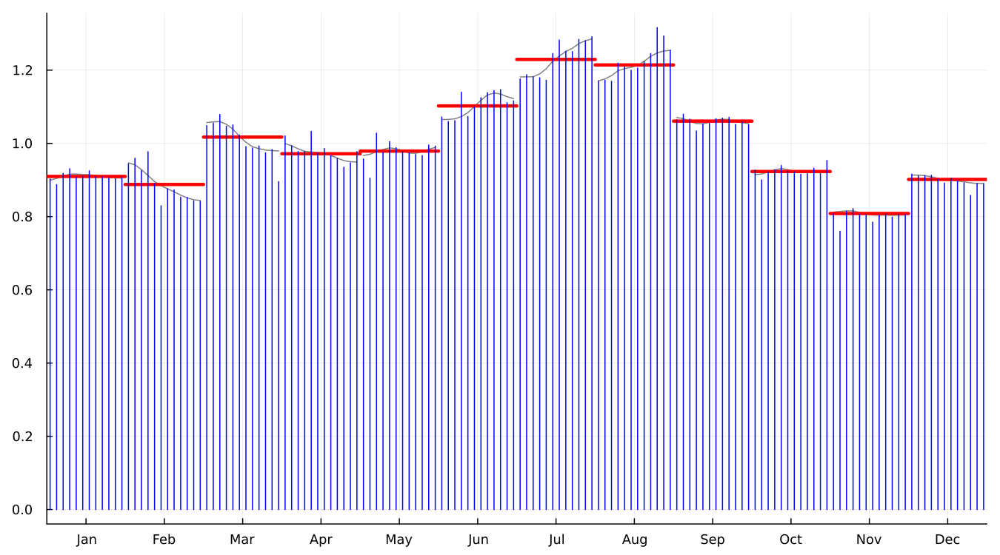
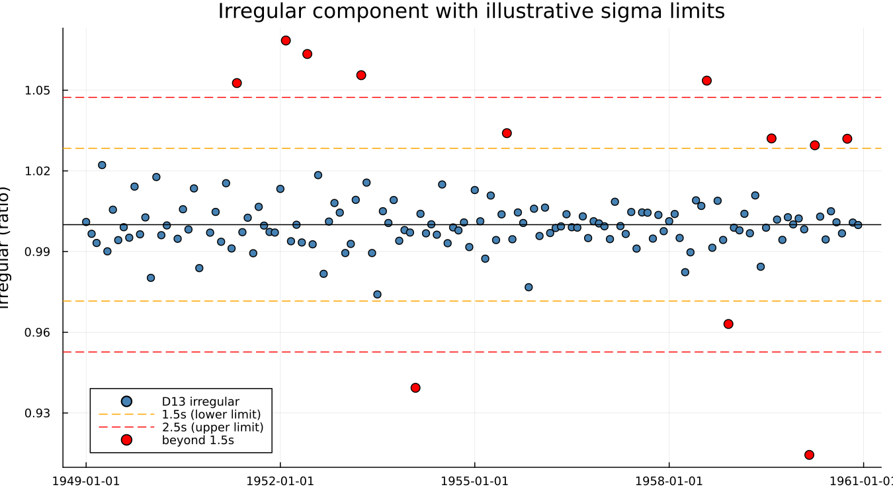
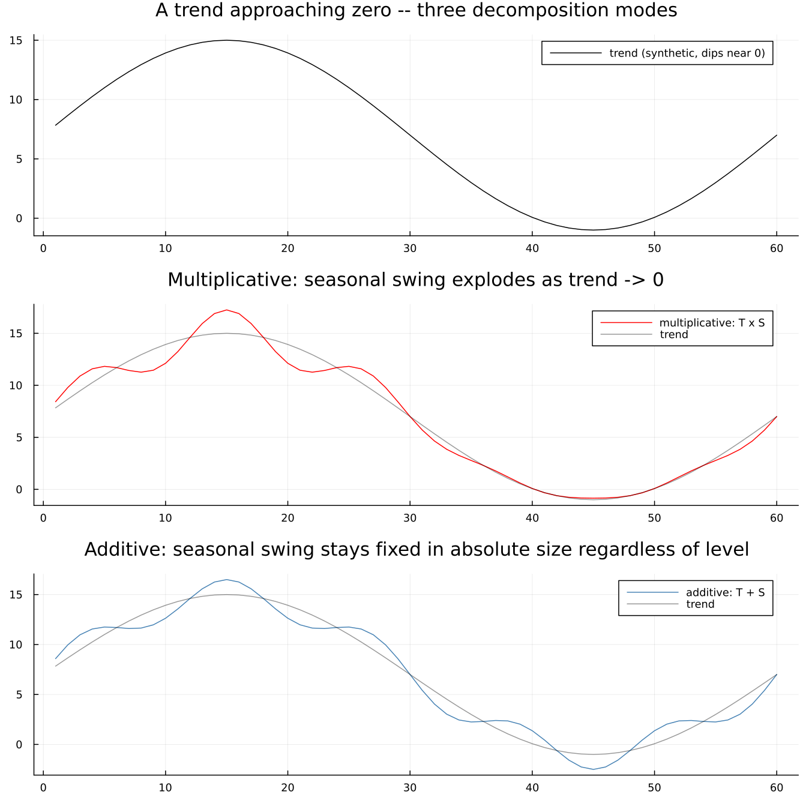

# 8. Extreme Values and Decomposition Modes

## 8.1 Sigma limits and graduated weights

An unusual month distorts more than just itself. Because the seasonal
factor for, say, every March is estimated from *all* the Marches in
the data, one anomalous March pulls the seasonal estimate for every
other March slightly off too. X-11's response is not to delete the
offending point — deleting data is rarely the right answer — but to
measure how far each irregular value sits from the bulk of the others
and give it a **graduated weight** that falls smoothly to zero as the
deviation grows, replacing heavily-downweighted points with an
estimate built from neighbouring years rather than discarding them
outright.

[`monthplot`](@ref) is the single most informative chart X-11
produces, and it is the direct payoff of Chapter 6's "filter across
years, not along the series" idea: each of the twelve bands below is
one calendar-position subseries, the stems are the individual SI
ratios (the scatter Chapter 4 first introduced), and the heavy bar is
the fitted seasonal factor for that month:

The irregular component itself, with illustrative sigma limits
marked:

X-13's own defaults are `siglim = (1.5, 2.5)` — confirmed by reading
the value back from a real run rather than assumed from memory, since
the pair is easily misremembered or transposed. A point beyond the
lower limit begins losing weight; beyond the upper limit it is fully
replaced. The bands drawn here use the irregular's own whole-series
standard deviation as an illustrative scale — X-13's actual internal
computation standardises per calendar month rather than across the
whole series, so the specific flagged points should be treated as
indicative, not a claim to have reproduced X-13's exact internal test.

**This is a genuinely different mechanism from a regARIMA outlier**,
and the distinction matters: X-11's extreme-value replacement happens
*inside* the filter, is silent, and leaves no explicit record beyond
the replaced value itself. A regARIMA outlier (Chapter 12) is
estimated as a regression coefficient, reported with a standard
error, and may be inspected or removed. Both exist in a full X-13
run, they do different jobs, and it is a common confusion to treat
them as one and the same thing.

## 8.2 Four decomposition modes

The choice between multiplicative, additive, pseudo-additive and
log-additive is not cosmetic — it is a claim about how the seasonal
swing relates to the level of the series.

- **Multiplicative** (`observed = trend × seasonal × irregular`): the
  seasonal swing grows in proportion to the level. Most economic
  series that grow over time behave this way — `airline` is the clean
  textbook case, confirmed multiplicative throughout this book.
- **Additive** (`observed = trend + seasonal + irregular`): the swing
  stays a fixed absolute size regardless of level.
- **Log-additive**: additive decomposition performed on the logged
  series, equivalent in spirit to multiplicative but estimated
  differently.
- **Pseudo-additive**: exists specifically for series whose level
  approaches zero. A multiplicative seasonal factor would have to
  explode toward infinity to represent a fixed-looking swing as the
  level shrinks toward nothing, and a plain additive model is usually
  wrong in the interior of a series that is mostly well away from
  zero. Pseudo-additive blends the two.

No dataset bundled with this package actually approaches zero, so the
figure below is a **labelled schematic on synthetic data**, not a
real X-13 run, illustrating why the problem exists rather than
demonstrating X-13's own handling of it:

A synthetic trend dips toward zero at its trough. Multiplied by a
fixed 15%-of-level seasonal factor, the swing visibly distorts and
would grow without bound the closer the trend sat to exactly zero;
added instead, the swing stays a constant absolute size no matter how
low the trend runs — which is a different, but equally real, kind of
wrong once the series is back up at a high level. **This figure will
be replaced with a real X-13 run once a genuinely near-zero or
zero-crossing series is available**; the schematic is included here
so that the chapter does not promise a comparison it cannot yet make
with real data, while still making the underlying reason concrete.

!!! info "In official statistics — mode is a convention, not a re-test"
    A statistical office does not typically re-test the decomposition
    mode every period. The mode is fixed by convention for a given
    published series, since switching it mid-history would render the
    published time series incomparable with itself across the switch —
    a discontinuity with nothing behind it but a methodological
    choice.

---

**See also:** Chapter 4's toy filter, which is deliberately
multiplicative-only and has no extreme-value handling at all —
everything in this chapter is what that toy leaves out. Chapter 12
for the regARIMA outlier mechanism this chapter's sigma-limit
replacement is often confused with.
