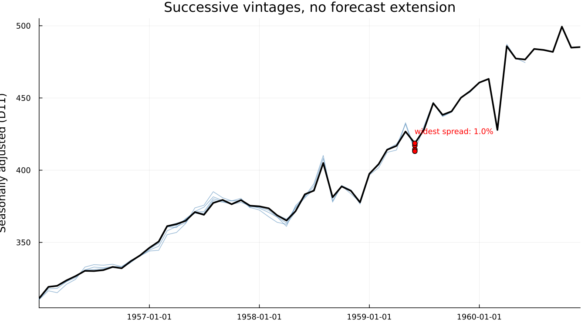
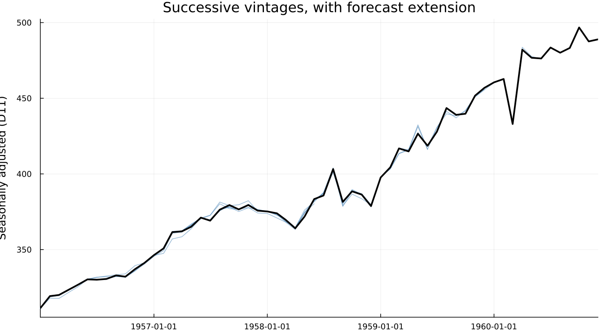

# 9. The End-of-Series Problem

## 9.1 The months that matter most

A statistical office publishes an adjusted figure for last month. Next
month, without any error and without any change in policy, that
figure changes. This is not a bug, nor is it sloppiness. It is a
direct, structural consequence of how X-11's filters work, and it is
the single best argument for everything that follows in this book.

The months a reader cares about most — the most recent ones — are
exactly the months X-11 estimates worst.

## 9.2 Why the ends are different

Chapter 5 introduced the Henderson filter as a symmetric, centred
moving average: to estimate the trend at month *t*, it uses
observations from both before and after *t*. That works everywhere
except at the two ends of the series, where the "after" observations
do not yet exist.

X-11's answer is the asymmetric end filters shown in Figure B-8 — the
same Henderson criterion, applied with only the data actually
available. They are a reasonable substitute, not a flawed
approximation of the symmetric filter; no version of the symmetric
filter could be applied at the series end, since it needs data that
does not exist.

## 9.3 Watching a series get revised

The consequence of an asymmetric filter is that the estimate at month
*t* depends on how much of the future was available when it was
computed. As more months arrive, the estimate for *t* is recomputed
with a filter that draws closer to symmetric, and it moves.

Figure C-1 makes this concrete. It runs the `airline` series
(`dataset("airline")`) through seven successive vintages — truncated
at six-month intervals from 1957-12 through the full sample at
1960-12 — with forecast extension turned off, and overlays the
seasonally adjusted series from each one.

The lines coincide through the interior of each vintage and separate
only as each approaches its own endpoint — exactly the region the
asymmetric filters apply to. That fan shape is the point: the same
calendar month carries several different "official" values, depending
on when one asked.

## 9.4 Dagum's fix

Estela Bee Dagum, working at Statistics Canada, published X-11-ARIMA
in 1980 with an answer to this that is almost embarrassingly simple to
state: if the problem is that the future has not arrived yet, forecast
it.

Fit a regARIMA model to the series, extend it forward with the
model's own forecasts, and run the ordinary *symmetric* Henderson
filter over the extended data. Every point that used to fall at the
series end, requiring an asymmetric filter, now has real neighbours on
both sides — synthetic ones, but close enough to make the symmetric
filter available. The asymmetric filter is never used at all when
this is switched on.

This is why X-13 has a forecasting model bolted onto the front of
what is, underneath, a smoothing procedure. The model exists to serve
the filter, not the other way about.

## 9.5 The same experiment again

Figure C-2 repeats the exact experiment from Figure C-1 — same seven
vintages, same axes, same scale — with forecast extension left on:

The lines are visibly tighter near each vintage's own endpoint.
Whether X-13 actually extends by default cannot be assumed — checking
`udg(res, "nfcst")` on a bare run confirms that it does, reporting
`nfcst = 12` (one year, the X-13 default) with no `forecast` block
requested at all. `forecast.maxlead = 0` is therefore what *removes*
extension, not what enables it.

Comparing the two figures by eye is suggestive. The number is what
makes the case:

| | mean absolute revision | largest single revision |
|---|---|---|
| without forecast extension | 0.38% | 1.04% (Jun 1959) |
| with forecast extension | 0.33% | 0.81% (Jun 1958) |
| reduction | **13.7%** | — |

Both figures compare the concurrent estimate at each vintage's own
endpoint against the final, full-sample estimate for the same month,
on the seasonally adjusted series (D11 — the series that gets
published).

**Read this honestly.** The reduction is real, consistently in the
right direction, and modest — not the dramatic effect a first telling
of this story might suggest. On this particular series, with this
particular vintage schedule, forecast extension trims a bit over an
eighth off the average revision. A modest, reproducible number is
worth more than a dramatic one that would not survive someone else
re-running it, and the literature's larger reported effects generally
come from series with a stronger trend and seasonal structure than
twelve years of airline passengers.

## 9.6 What this means in practice

Two policies exist for what to do about this. **Concurrent
adjustment** re-estimates the entire adjustment every period as new
data arrives, giving the most current model and filter but accepting
that recent months will keep revising. **Forward-factor adjustment**
fixes the seasonal factors for a year at a time and only applies
them, trading some accuracy for a stability that downstream users of
the published number may rely on.

Neither is simply correct. Which one a statistical office runs is a
published revision policy, not an implementation detail — and it is a
direct answer to the question with which this chapter opened.

After this, a forecasting model sitting in front of a smoothing
procedure should no longer look strange. Chapters 10 through 13 are
refinements of exactly this model: what goes into it, and why.

---

!!! note "Gotcha — fix the transform across vintages"
    This is the most important box in the chapter, and it is a real
    bug, not a hypothetical one.

    If `transform = :auto` were left on for Figure C-1/C-2, each
    vintage would re-run the log-versus-none test on its own,
    truncated data. A shorter vintage can select `:none` where the
    full sample selects `:log`. Multiplicative seasonal factors sit
    near 1.0; additive ones sit in raw level units. The "revision"
    computed between the two would then be a units mismatch reported
    as instability — large, and meaningless.

    `transform = :log` is pinned explicitly across every one of the
    fourteen runs behind these figures, and `transformfunction(res)
    === :log` is asserted for all fourteen in
    `test/test_book_examples.jl`, not merely checked once by eye.

    The same caution applies to any comparison across differently
    sized samples: ablation studies, split-half stability checks,
    sliding spans (Chapter 20). Fix everything that is not the thing
    being varied.

!!! tip "Under the hood — the asymmetric filters"
    Musgrave's asymmetric end filters are not an ad hoc patch. They
    are derived the same way the interior Henderson filter is — by
    minimising expected mean squared revision — but with the
    constraint that only already-observed data may be used, and with
    an assumption about how the series is expected to continue near
    the end. Ladiray & Quenneville give the full derivation and the
    resulting weight tables for each filter length; Figure B-8 in
    Chapter 5 shows the weights themselves.

!!! info "In official statistics — revision policy"
    Concurrent adjustment gives the most accurate available estimate
    every month, at the cost of a published time series that keeps
    changing after release. Forward-factor projection publishes a
    number that will not move again until the factors are next
    re-estimated, at the cost of using filters known, in advance, to
    be slightly wrong. Most national statistical offices publish which
    policy they follow and how often factors are re-estimated; the
    ESS Guidelines on Seasonal Adjustment discuss the tradeoff
    directly. Neither choice is hidden from users of the published
    series, and it ought not be treated as an implementation detail
    here either.

---

**See also:** Chapter 5 for the filters this chapter's problem
originates in, and Chapter 7 for where forecast extension sits in the
B/C/D pass sequence. Chapter 13 treats forecasts as an end in
themselves, with prediction intervals; this chapter used them only as
a means to a better trend filter.
