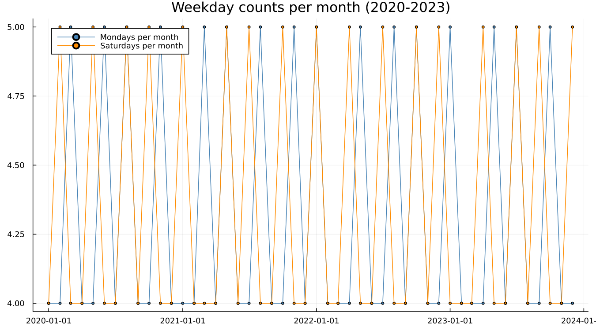
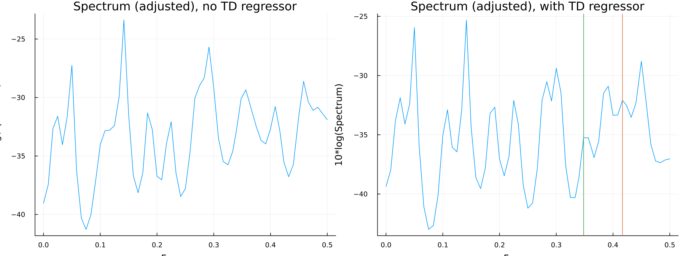
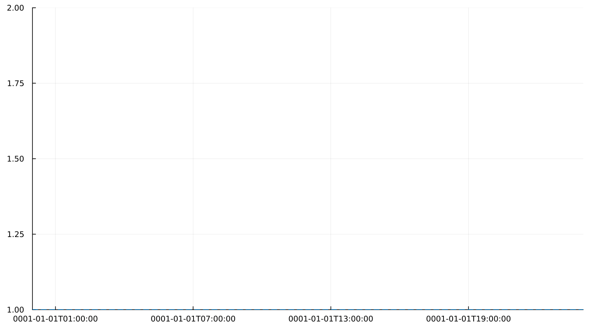

# 10. Trading Day

## 10.1 Months are not interchangeable

A month is not a fixed unit — it contains a different number of Mondays,
Saturdays, and every other weekday depending on which year it falls in.
Pure calendar arithmetic, no series involved:



Across 2020–2023, a given calendar month has either four or five of any
particular weekday. A retail series that depends on how many Saturdays a
month happened to have is responding to something with nothing to do
with the season — it is a calendar-composition effect, and it needs its
own regressor rather than being absorbed, incorrectly, into the seasonal
factor.

## 10.2 Six contrasts and one simplification

X-13's trading-day regression uses six day-of-week contrasts, not seven.
The seventh is redundant once six are known and the month's total length
is fixed: given how many Mondays through Saturdays a month has, the
number of Sundays follows automatically, so including a seventh
contrast would be exactly collinear with the other six plus the
month-length information already in the model. A simplified
one-coefficient version — weekday activity versus weekend activity — is
also available and is what `airline`'s own canonical spec below actually
uses.

## 10.3 Does this series have it?

`aictest` fits the model with and without a trading-day regressor and
compares information criteria to decide whether it belongs. On
`appliance`, requesting the full six-contrast test:

```
F(6, 173) = 14.97,  p = 9.2e-14
```

Emphatically present — retail sales responding to which days of the week
a month contains is exactly what a reader would expect.

The more interesting result is the aside. `airline` is passenger travel,
not retail, and a reader might reasonably assume trading day is a
retail-specific phenomenon. It is not. On the canonical airline spec
(the same one Getting Started chapter 4 and Part V both use), the
one-coefficient simplified trading-day test reports:

```
F(1, 128) = 31.06,  p = 1.4e-7
```
— strongly present, on a series about air travel. A trading-day effect
is a calendar-composition effect, not a retail-specific one, and it
shows up wherever a process depends even loosely on which days of the
week are business days.

The spectral evidence tells the same story, before and after a
trading-day regressor is added on `appliance`:



## 10.4 How large is it?

The estimated effect as a time series, via `components(res; which =
:trading_day)`:



---

**See also:** Chapter 18 for how a trading-day spectral peak is read
alongside the seasonal one. Chapter 11 for a second calendar-composition
effect — one that moves between calendar months entirely, rather than
just varying within one.
