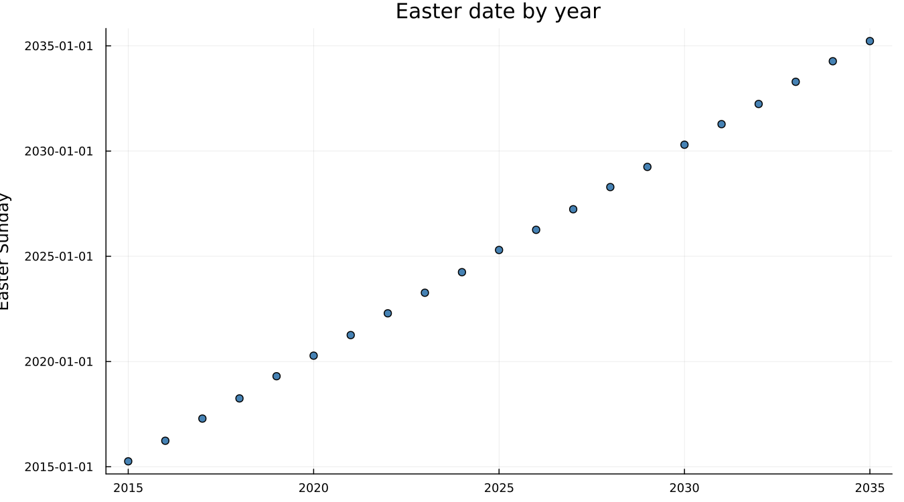
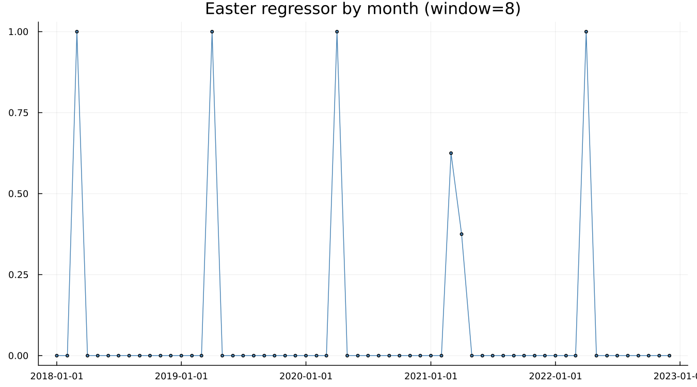
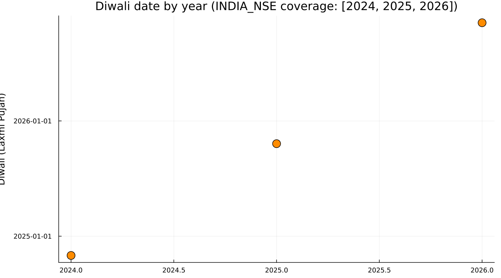
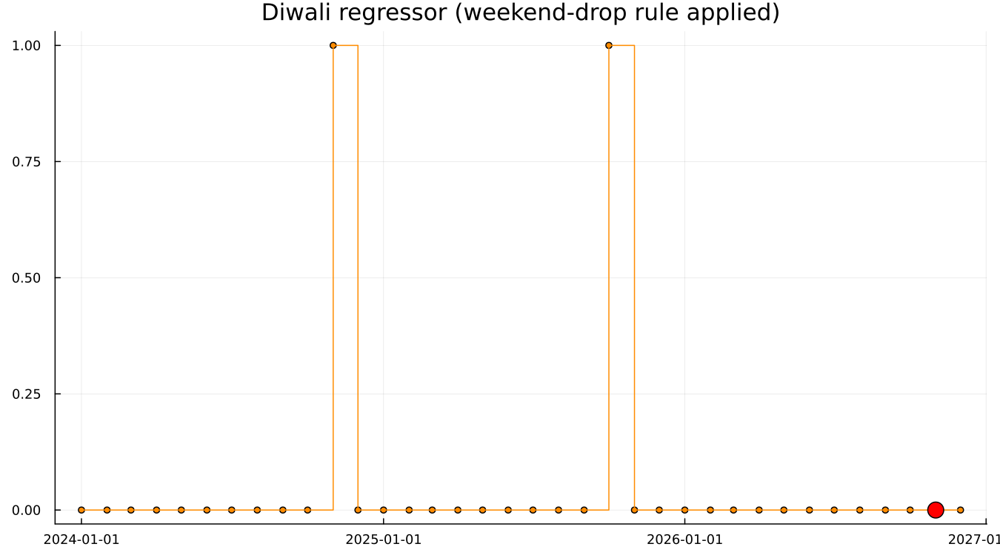
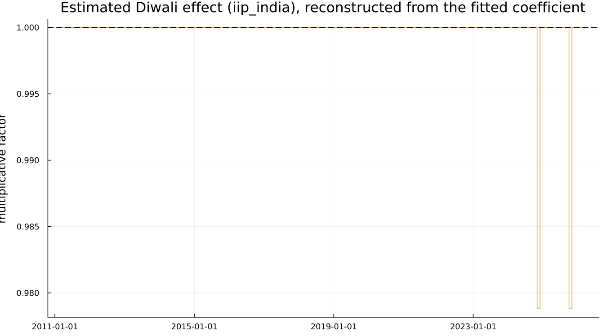

# 11. Moving Holidays

## 11.1 The problem a fixed seasonal factor cannot solve

A holiday fixed to a calendar date — Christmas, always December 25 —
is absorbed cleanly by December's own seasonal factor, year after
year. A holiday whose date *moves* cannot be so absorbed, because the
month it lands in changes from year to year, and a seasonal factor is
defined per calendar month. That single distinction is this whole
chapter.

## 11.2 Easter

Easter's date varies across roughly a month, landing in either March
or April:

Over 2015–2035, Easter falls in March in 5 of 21 years and in April in
the rest — genuinely split across two calendar months, not a fixed
December-25-style date.

## 11.3 The window model

X-13's Easter regressor spreads the holiday's effect over a window of
`w` days immediately before Easter, allocated to whichever calendar
months that window overlaps — `Easter[1]` means a one-day window:

On the canonical airline spec, `Easter[1]`'s estimated coefficient is
real and significant: `coef = 0.017767, se = 0.007158, t = 2.482`. The
regressor is centred — long-run monthly means are subtracted out — so
that it does not compete with the ordinary seasonal factors sitting
alongside it in the same model.

## 11.4 Diwali, and why nothing built in fits

X-13 ships built-in support for Easter, Labor Day and Thanksgiving —
three holidays, all specific to the U.S. and European calendar.
Diwali, observed across India, moves between October and November
from year to year and has no built-in equivalent (neither does
Chinese New Year, nor Eid). The dates themselves, from this package's
own `INDIA_NSE` calendar table (which currently covers 2024–2026 — the
real, current coverage, not a longer illustrative range):

2024's Diwali fell on a Friday, 2025's on a Tuesday, 2026's on a
Sunday — genuinely moving across the calendar and, in 2026's case,
landing on a day that was already a non-trading weekend.

## 11.5 Building the regressor

[`custom_holiday_regressor`](@ref) builds exactly the data a
`regression { user = (...) }` block requires: `1.0` in whichever month
each year's holiday falls, `0.0` elsewhere — with one deliberate
refinement.

**The weekend-drop rule is a real methodological choice, not an
implementation detail.** A holiday that lands on a day that was not a
trading day in any case produces no incremental trading effect to
explain, so it contributes `0.0` rather than `1.0` even in the month
it falls in — visible above as 2026's Sunday-Diwali month, which the
regressor correctly declines to flag. A simpler, bare month-dummy
approach would flag it regardless of weekday, silently overstating the
effect in years where the holiday happened to fall on a day nothing
was open in any case. This is a genuine improvement over the simplest
possible construction, not a cosmetic one.

!!! warning "Gotcha — declaring a user regressor needs `user=` alone"
    A real trap, found while building this chapter's own example:
    adding the user regressor's own name to `regression_variables` —
    the natural thing to try, by analogy with how built-in regressors
    like `"td"` are selected — makes the real binary reject the spec
    outright (`Regression variable name "..." not found`), regardless
    of what the regressor is actually named. `user = (name)` alone is
    what includes a user-defined regressor in the model; naming it a
    second time in `variables =` breaks it rather than reinforcing it.
    Confirmed directly against the binary, not inferred from the error
    message alone.

## 11.6 The estimated effect

`components(...; which = :user)` requests X-13's own `.usr` table,
which the package correctly asks the binary to save
(`regression { ... save = (usr) }` renders and runs without error) —
but the real binary simply does not materialise a `.usr` file for a
holiday-type user regressor under this configuration, confirmed
directly by inspecting the run's own output directory. This is a
genuine characteristic of X-13 itself, not a package routing bug, and
is worth stating plainly rather than silently working around. The
estimated effect below is reconstructed directly from the fitted
coefficient instead: a real, small, negative effect, `coef = -0.0214`
in log space, a `-2.1%` multiplicative dip in the two Diwali months
the regressor actually flags within `iip_india`'s own history (2026
has not yet occurred within the data):

A modest, real result — industrial production dips slightly around
Diwali, plausibly reflecting reduced factory activity during a major
holiday period — reconstructed honestly from what two flagged months
in a fifteen-year series can actually show, and not overstated.

---

**See also:** Chapter 1 §1.3, where this exact example first
motivated the need for a moving-holiday regressor. Chapter 12 for
`iip_india`'s other real feature — a dramatic, unrelated COVID-era
level shift.
