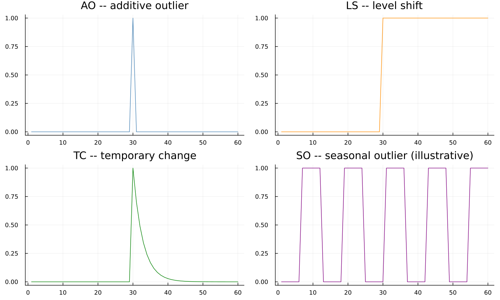
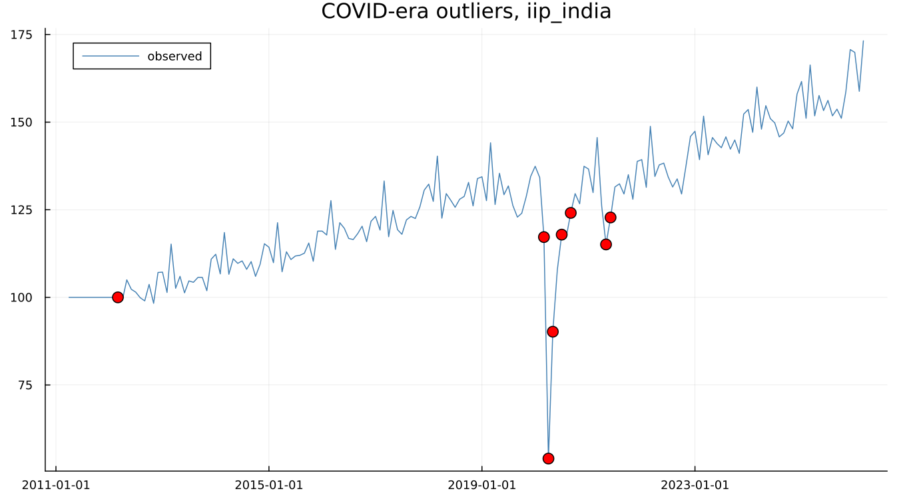

# 12. Outliers and Interventions

## 12.1 Four shapes

RegARIMA recognises a small family of intervention shapes, worth seeing
as pictures before reading their definitions:



An **additive outlier (AO)** affects a single observation and nothing
else. A **level shift (LS)** moves the series permanently to a new
level from that point forward. A **temporary change (TC)** spikes and
then decays back toward the original level over a few periods. A
**seasonal outlier (SO)** — shown here schematically — affects one
calendar position's seasonal pattern specifically, an intervention type
not part of every regARIMA implementation. The distinction that matters
most in practice is between the first two: an AO is a one-month blip, an
LS is permanent, and treating one as the other misreads the series'
actual behaviour going forward.

## 12.2 Finding them automatically

Detection works by iterative t-testing against a critical value that
depends on series length — larger series test more values, and the
threshold adjusts accordingly. On the canonical `airline` spec:

```
AO1951.May:  coef 0.100156,  se 0.020439,  t = 4.900
counts:      ao 1, ls 0, tc 0, so 0, total 1
```

Worth making explicit: **this outlier is not visible in the levels.**
The surrounding raw values are 163, 172, 178 for April, May and June —
nothing jumps out to the eye. Detection runs on regARIMA residuals
*after* differencing, comparing what the fitted model expected against
what actually happened, not on the raw series itself. Getting Started
chapter 4 first raised this fact; this is where the mechanism behind it
is explained.

## 12.3 A real case

`iip_india` carries a genuine, dramatic signature — already flagged in
this dataset's own provenance notes, and confirmed directly here by
actually running outlier detection rather than assumed from the raw
numbers alone:



Eight outliers total, heavily clustered around one event: `LS2020.Mar`
(a level shift beginning the month India's COVID lockdown started),
`AO2020.Apr` and `AO2020.May` (the two months of the sharpest actual
drop — April 2020 reads 54.0 against a March 2020 reading of 117.2, the
single largest month-over-month move anywhere in the series),
`LS2020.Jul` and `LS2020.Sep` (further level adjustments as activity
partially recovered), and `AO2021.May`/`AO2021.Jun` (a second, smaller
disruption consistent with India's 2021 COVID wave). This is not a
constructed example — it is what automatic detection finds on a real
series, unprompted, at exactly the dates an independent reader would
expect a real economic shock to appear.

## 12.4 When not to trust the detection

Detection near the very end of a series is unreliable. There is not yet
enough subsequent data to distinguish a temporary blip from the start of
a permanent shift, so a level shift flagged in the last few months of a
series is provisional — it may be reclassified, or vanish entirely, once
more data arrives. This is easy to forget in practice and worth stating
plainly: an outlier near the end of a freshly adjusted series deserves
more scepticism than one comfortably in the interior.

!!! info "Boundary — not the same mechanism as Chapter 8's replacement"
    Keep this clearly separate from X-11's own extreme-value handling
    (Chapter 8). X-11 downweights an unusual observation *inside* the
    filter, silently, and leaves no explicit record beyond the replaced
    value. A regARIMA outlier, covered in this chapter, is estimated as
    an actual regression coefficient with a reported standard error, and
    can be inspected, questioned, or removed directly. Both exist in a
    full X-13 run; they do different jobs, and treating them as the same
    mechanism is a common and avoidable confusion.

---

**See also:** Chapter 8 for X-11's own, different extreme-value
mechanism. Chapter 19 for what an *unflagged* problem in the residuals
looks like instead of an outlier.
