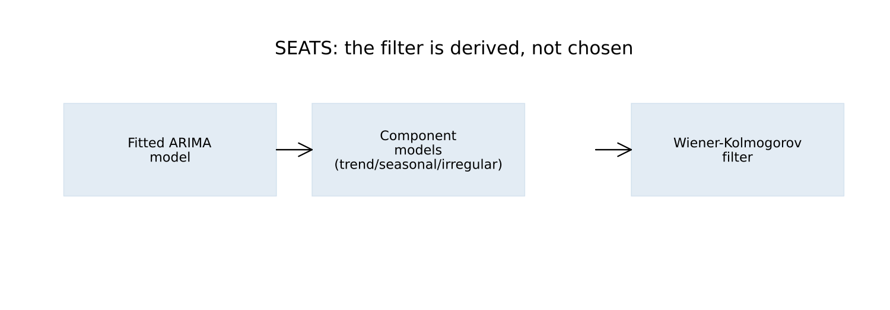
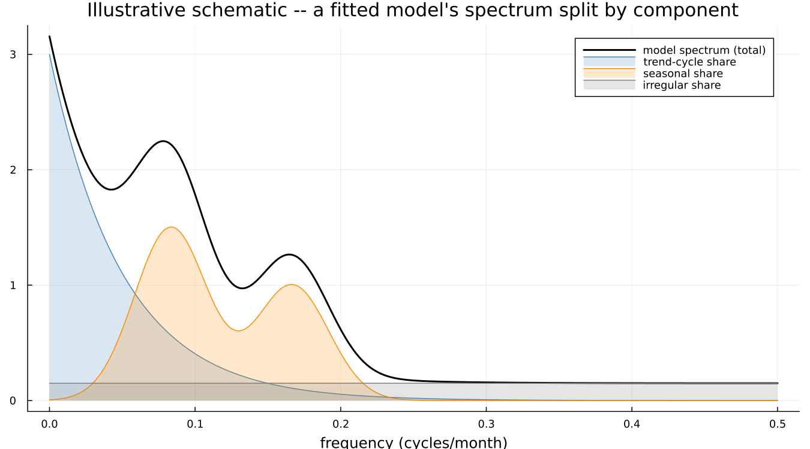
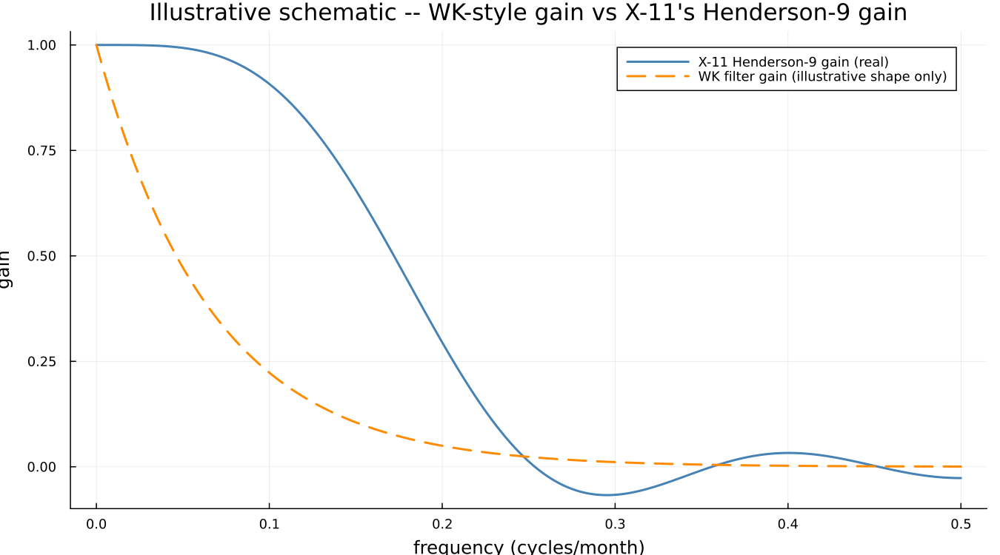

# 14. Decomposing a Model

## 14.1 A filter you did not choose

Part II showed X-11 selecting a seasonal filter from a fixed family —
3×3, 3×5, 3×9 — using the moving seasonality ratio to pick a member. The
family itself is fixed in advance by the method; the data only picks
which member of it applies.

SEATS does not have a family to choose from. It fits an ARIMA model to
the series, decomposes *that model* into component models, and the
filter that results falls directly out of the decomposition:

This is the natural question a careful reader of Part II will already
have formed: where did X-11's filter families come from, and why those
specific ones? X-11's answer is decades of accumulated practice. SEATS'
answer is the fitted model itself — two series with genuinely different
dynamics get genuinely different filters, not two members drawn from the
same fixed list.

## 14.2 Splitting the model

An ARIMA model implies a specific autocovariance structure, and
equivalently a specific spectrum — power distributed across frequencies
in a shape the fitted model determines. That spectrum concentrates power
at particular frequencies (seasonal ones, especially), and SEATS'
decomposition assigns each part of it to a component, each component
itself expressible as its own ARIMA model:

**This is a labelled illustrative schematic**, not the actual spectral
decomposition of any specific fitted model — deriving that precisely
requires factoring the model's own autocovariance generating function
into component pieces, real signal-processing work substantially harder
than Part II's filter derivations, and a step this book does not attempt
to reproduce numerically. The shape shown is the right *idea*: trend
concentrated at the lowest frequencies, seasonal concentrated in narrow
bands at the seasonal harmonics, irregular spread flat across everything.

!!! details "Under the hood — partial fractions on the autocovariance generating function"
    The actual derivation factors the model's autocovariance generating
    function into a sum of terms, each attributable to one component,
    via partial fractions — a real, well-established technique, and the
    reason the SEATS decomposition is unique given the fitted model
    (unlike X-11's own filter choice, which is a selection among
    alternatives). Dagum & Bianconcini give the full treatment.

## 14.3 The filter that falls out

Given the component models, the minimum-mean-squared-error filter for
extracting each one follows directly — the Wiener-Kolmogorov filter.
Comparing its general *shape* against X-11's own real, computed
Henderson-9 gain (Chapter 5):

The Henderson-9 curve here is real, taken directly from Chapter 5's own
computation. The Wiener-Kolmogorov curve is an illustrative shape only —
a smooth, monotonically decaying gain, contrasted against Henderson-9's
own non-monotone ripple (the small negative lobe visible past 0.3 cycles
per month, the same feature that lets a Henderson filter sharpen a
turning point). The qualitative point — a model-derived filter and a
criterion-optimised finite filter are two different solutions to a
related problem, not the same solution reached two ways — is real; the
specific WK curve shown is not derived from a fitted model here.

## 14.4 When it does not work

The decomposition is not always possible. Some fitted models admit no
valid split into components with non-negative spectra — a mathematical
requirement for each piece to correspond to a genuine random process —
and when that happens SEATS either fails outright or substitutes a
nearby model that does admit a valid decomposition. This is controlled
by `noadmiss`, and it has no X-11 analogue whatsoever: X-11 always
produces *an* answer, because it is a fixed procedure applied to data
rather than a decomposition that can fail to exist for a given model.

This is a real limitation of the model-based approach, not a software
quirk, and worth stating as plainly as X-11's own accepted limitations
were stated in Part II. This package's own default behaviour for
`noadmiss` was not independently confirmed while writing this chapter —
flagged here rather than assumed, since R's `seasonal` package sets its
own default explicitly (`seats.noadmiss = "yes"`), which suggests the
binary's own bare default may differ and is worth checking directly
before relying on it.

---

**See also:** Chapter 6 for X-11's own filter-family convention, the
direct contrast this chapter draws throughout. Chapter 15 for what
happens when the two methods are run side by side on the same series.
