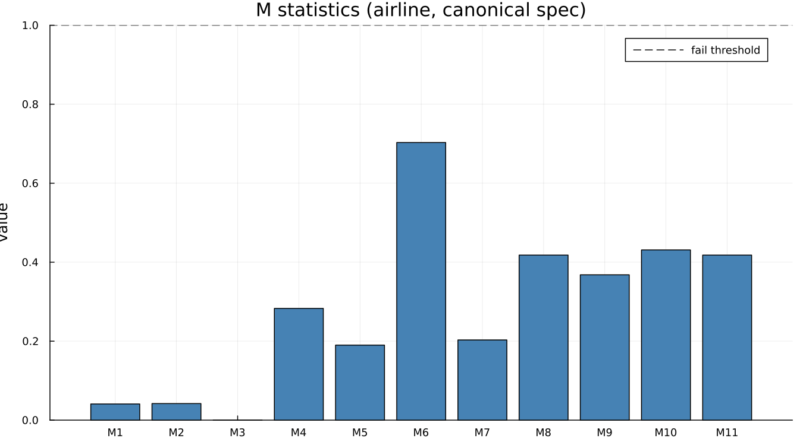
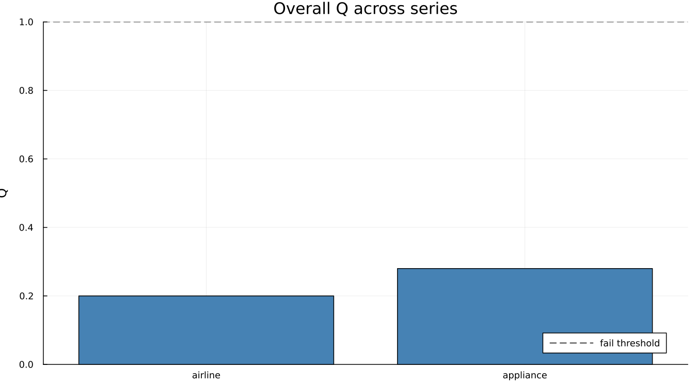

# 17. The M Statistics and Q

## 17.1 The eleven, in words

Every M statistic targets one specific way an adjustment can go
visibly wrong — an unstable seasonal, a trend too rough to be
believed, an irregular too large relative to the rest. Each is scaled
so that **1.0 is the failure threshold**: below 1.0 is acceptable, at
or above is flagged. On the canonical airline spec:

Every one of the eleven sits comfortably under 1.0. **M7 deserves its
own sentence**, since it is the one practitioners quote on its own
more than any other: it tests specifically whether identifiable
seasonality is present at all, and an M7 above 1.0 is often read
informally as "this series probably ought not to be adjusted in the
first place." Here it reads 0.203 — unambiguously identifiable
seasonality, which is exactly what one would expect from twelve years
of airline passenger counts.

Worth noticing directly from the numbers rather than the bar chart
alone: **M3 is exactly 0.000 and M6 is 0.703 — seventeen times larger,
and both pass.** The eleven statistics are not on a common "how badly
did this go" scale. They measure genuinely different things, and
comparing their raw values against one another across the row is not
a meaningful comparison, even though comparing each one to its own
threshold is.

## 17.2 How Q combines them

Q is a *weighted* average of the eleven, not a plain mean — some
statistics carry more diagnostic weight than others in the combined
score. On this run, `Q = 0.20`, comfortably under 1.0. `Q2` is a
companion figure that excludes M2 specifically; here it reads `0.22`,
close to but not identical to Q, which is expected since dropping one
component of a weighted average moves the total only slightly when no
single component dominates it.

## 17.3 Where they mislead

Two limits are worth stating plainly rather than discovering by
surprise later in the book.

**They do not apply to SEATS at all.** M1–M11 and Q are X-11
constructs, built from X-11's own B/C/D-pass intermediate tables.
[`mstats`](@ref) returns `nothing` for a SEATS run — not an error, not
a zero, `nothing` — since the question these statistics ask does not
have a SEATS-shaped answer. Chapter 15 returns to this directly: it is
the reason a SEATS adjustment cannot be compared against an X-11 one
on Q alone.

**A clean Q says nothing about whether the underlying regARIMA model
was right.** Chapter 19 demonstrates this on this exact series: the
same airline run that produced the Q of 0.20 above also fails a
Ljung-Box test for residual autocorrelation. Q measures the
*output*'s plausibility, not the *model*'s adequacy, and those are
different questions that happen to agree usually — though not always.

A soft, illustrative comparison across two different series, run
under comparable settings:

Both pass comfortably, and `appliance`'s own Q (0.28) sits a little
higher than `airline`'s (0.20) without either coming close to the 1.0
line — two real, different series, not a designed contrast between a
clean case and a poor one.

---

**See also:** Chapter 15 for why Q cannot arbitrate between X-11 and
SEATS. Chapter 18 for what QS adds that Q does not measure at all.
Chapter 19 for the Ljung-Box failure hiding behind this chapter's
clean Q.
