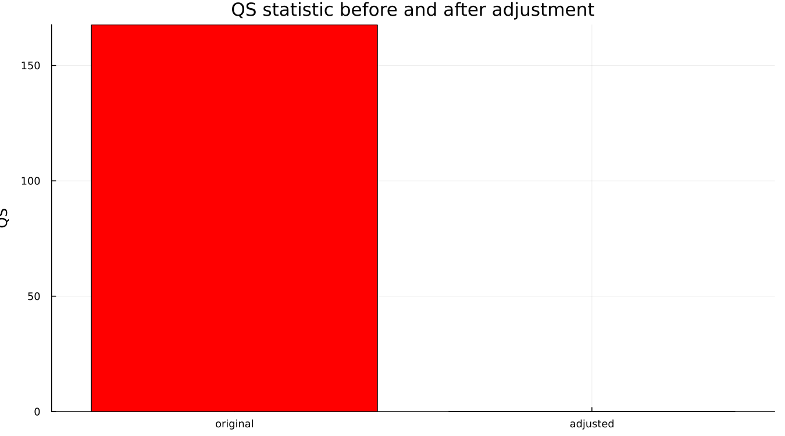
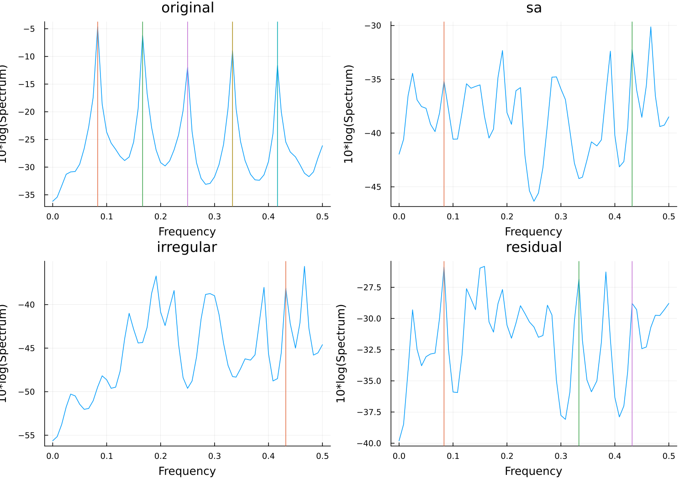
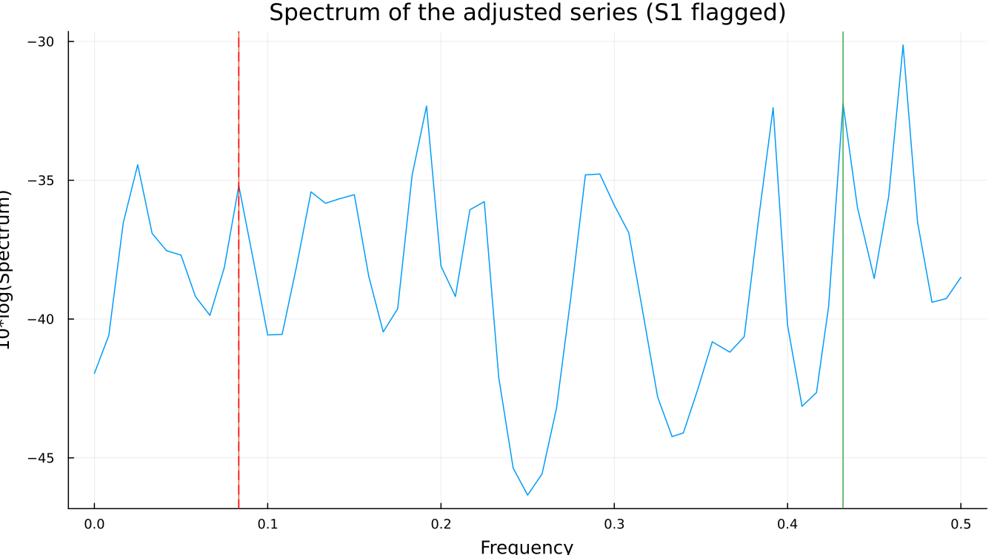
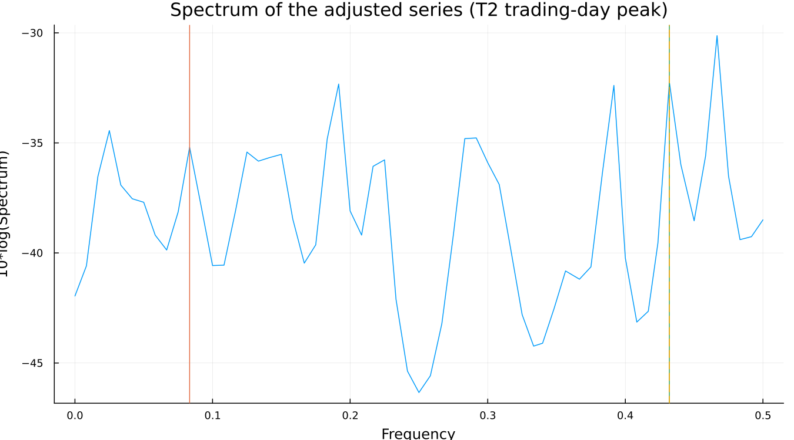

# 18. Residual Seasonality

## 18.1 The QS test

QS tests for autocorrelation specifically at seasonal lags — the pattern a
reader wants to see is significant seasonal autocorrelation in the
*original* series and none left in the *adjusted* one:



On the canonical spec, `QS(original) = 167.65` (`p = 0.000`) collapses to
`QS(adjusted) = 0.00` (`p = 1.000`). Read on its own, that is about as
clean a result as this test can report — the original series was
overwhelmingly seasonal, and after adjustment there is exactly none left
by this measure.

## 18.2 The F-tests

[`seasonality_tests`](@ref) adds the stable and moving seasonality
F-tests (from the D8 SI-ratio table Chapter 6 introduced) and a combined
identifiable-seasonality verdict. All of them agree with QS's own verdict
on this series: strongly, unambiguously identifiable seasonality in the
original data.

## 18.3 Reading a spectrum

A spectrum shows how much power a series has at each frequency. Five
frequencies get specific attention in an X-13 spectrum: the seasonal
frequency and its harmonics (roughly 1, 2, 3, 4 and 5 cycles per year —
labelled S1 through S5), and two trading-day frequencies (T1, T2). `.udg`
reports each one as either `nopeak` or a height with a `+` marker, and the
four series worth comparing are laid out together:



The original series' spectrum (top left) is dominated by seasonal power;
the adjusted, irregular and residual spectra are comparatively flat —
visually, adjustment worked.

## 18.4 When they disagree

Here is where the chapter earns its length, and the number is verified,
not illustrative:

```
QS on the seasonally adjusted series:  0.00,  p = 1.000
spcsa.s1  (first seasonal frequency):  8.5 +
spcsa.t2  (second trading-day freq.):  12.0 +
```

**QS says the adjusted series has no seasonality left. The spectrum of
that exact same series has a flagged peak at a seasonal frequency.**



Both are correct, and both are measuring something real — they are simply
not measuring the *same* thing. QS tests for autocorrelation specifically
at seasonal *lags*; the spectrum looks for concentrated power at seasonal
*frequencies*. A small regular component can register clearly in one
without moving the other by much, and that is exactly what has happened
here: the flagged S1 peak sits at a fairly modest height relative to the
spectrum's other local peaks (visible in the figure above), while a much
more prominent peak — at the trading-day frequency T2 — sits elsewhere
entirely:



`spcsa.dom` — whether the flagged S1 peak is the *dominant* feature of
the spectrum, not merely a flagged one — reports `no` here. A flagged,
non-dominant seasonal peak on an adjustment that otherwise passes cleanly
is common, and by itself is not a reason to reject the result. What it is
a reason to do is treat it as a prompt: look for a calendar effect or
regressor that might still be missing, the same way Part III's trading-day
and holiday chapters describe finding one.

Say plainly what makes this worth a full chapter rather than a footnote:
**this is the most-used series in the field, adjusted with ordinary
settings, not a case constructed to make the point.** That is what makes
the disagreement land as a real property of the method rather than a
contrived illustration of one.

---

**See also:** Chapter 16 for why a disagreement like this is the expected
consequence of an unidentified decomposition, not a malfunction. Chapter
10 for the trading-day effect the T2 peak above is evidence of.
