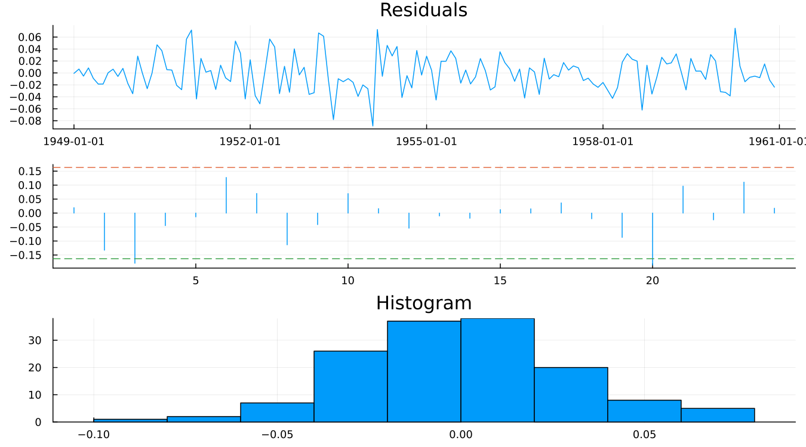
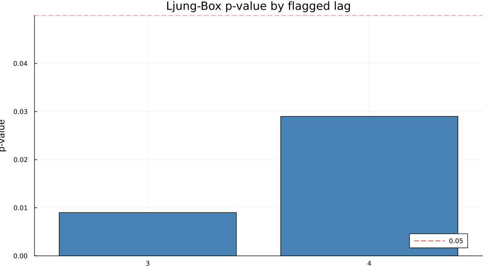

# 19. Model Adequacy

## 19.1 Residual autocorrelation

Everything in chapters 17 and 18 evaluated the *output* — the adjusted
series itself. This chapter evaluates the *model* that produced it, via
the same regARIMA residual diagnostics any time series model gets: are the
residuals free of leftover autocorrelation?

The middle panel plots the residual ACF against a significance band, and
two lags cross it — 3 and 20. The ACF/PACF panel is where a reader spots
it visually; the Ljung-Box test gives it a number:

**The airline model — the same model that produced a Q of 0.20, passed all
eleven M statistics, and drove QS to exactly zero on the adjusted series —
fails Ljung-Box at lags 3 and 4** (`p = 0.009` and `p = 0.029`).

Two details worth explaining rather than glossing over:

- X-13 reports **only the lags where the test is significant** — `nlbq =
  2`, listing lags 3 and 4 specifically. An empty list is the good
  outcome; a short list, as here, is the informative one, not a sign that
  something is broadly wrong.
- The ACF significance band X-13 draws is `acflimit = 1.6` standard
  errors, **not the 1.96 a reader familiar with a plain 95% normal
  interval will expect.** The two conventions are close but not the same
  number, and treating 1.6 as if it were 1.96 would make X-13's own
  flagged lags look like false positives.

## 19.2 Normality and other checks

The distributional side of the same residuals is clean: skewness
`0.0900`, kurtosis `3.0698` (a normal distribution's own kurtosis is
3.0), Durbin-Watson `1.9504` (close to the no-first-order-autocorrelation
value of 2.0). **The failure in 19.1 is specifically about
autocorrelation at lags 3 and 4, not about the residuals' shape** — a
distinction the diagnostics above make precisely rather than leave to
guesswork.

## 19.3 What a failure actually means

A Ljung-Box failure like this one is usually a sign of a **missing
regressor** — a calendar effect, an unflagged outlier, a level shift —
rather than evidence that the ARIMA order itself is wrong. This is the
natural place to point back to Part III's own regressors and Chapter 12's
outlier handling as the first things worth checking before touching the
model order at all.

And the honest verdict for this particular case: the airline model is
famously *adequate*, not perfect, and every other diagnostic in this book
so far has been clean on it. Two significant lags out of a residual ACF
this long, with no distributional problem alongside them, is a mild
failure that no practitioner would treat as grounds to reject the
adjustment. **Reporting a failing p-value without saying whether to care
about it teaches a reader nothing** — so: this one is real, it is small,
and it does not change the recommendation to use this model.

---

**See also:** Chapter 17 for the M statistics and Q this same model
passed cleanly. Part III (chapters 10–12) for the calendar and outlier
regressors a Ljung-Box failure like this one usually points back to.
