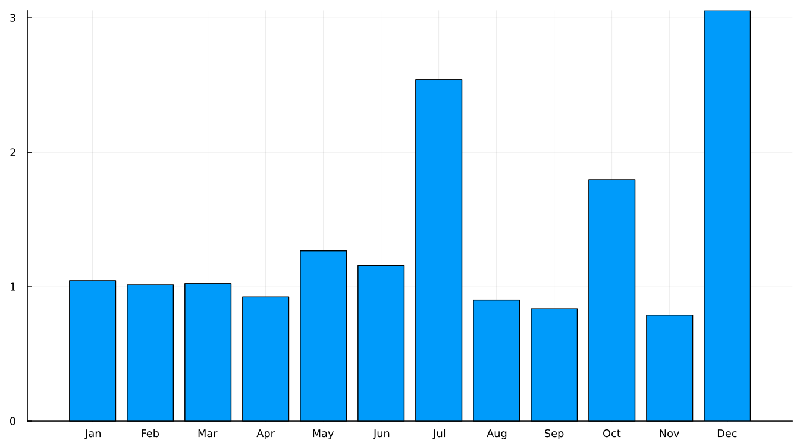
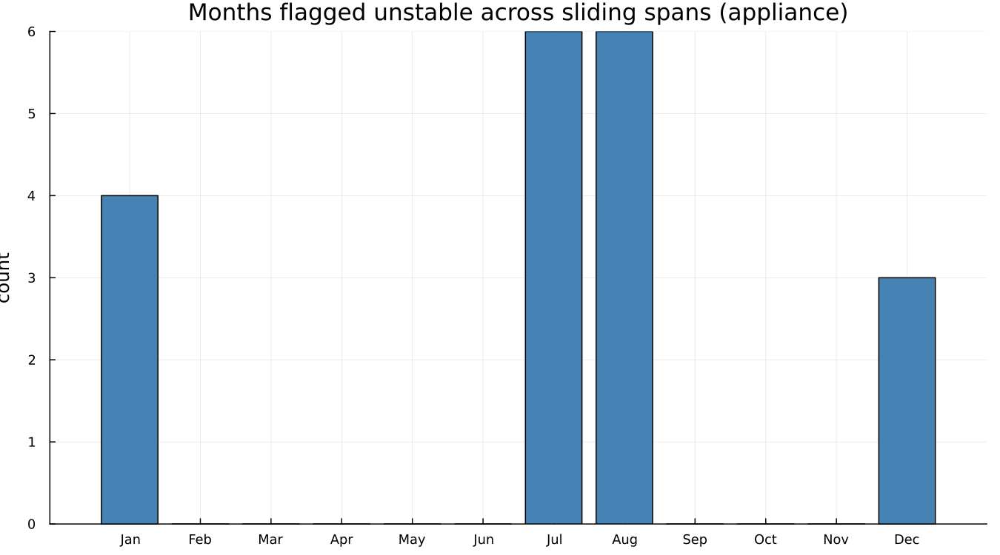
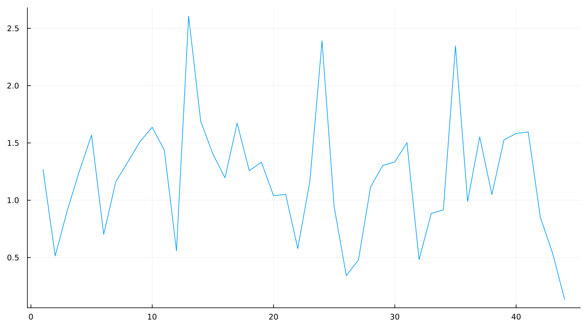
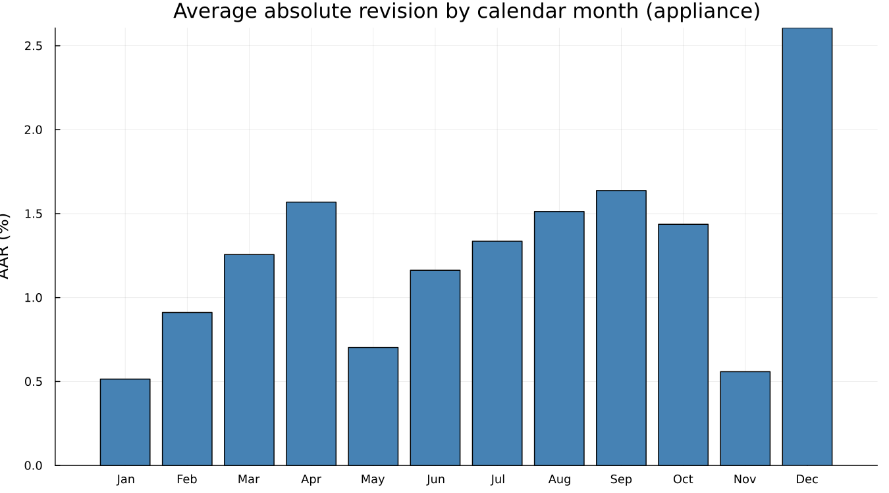

# 20. Stability and Revisions

Every diagnostic so far has asked some version of "is this adjustment
right." Sliding spans and revision histories ask a different question
entirely: **will it still look like this next month?** — which, for an
official statistic somebody downstream is going to act on, matters at
least as much as correctness at a single point in time.

This chapter uses `appliance`, the Census Bureau's own worked example,
rather than `airline` — a 192-month series gives sliding spans enough
overlapping windows to say something, where twelve years does not.

## 20.1 Sliding spans

Adjust several overlapping spans of the same series — drop a year or two
off the end, adjust, repeat — and compare the estimates for whatever
months are covered by more than one span. A month whose estimate swings a
lot depending on which span produced it is flagged unstable. The headline
percentages, read directly rather than assumed:

```
seasonal factor:        18% of months flagged unstable
SA percent change:      19%
trend:                  18%
trading day:            14%
```

Broken down by calendar month, using the seasonal-factor breakdown
specifically:



December stands out clearly as the least stable month in this series'
seasonal factor. A separate, related view — how many spans actually
flagged each month as unstable, using the percent-change breakdown this
time:



July and August lead here on flag *count*, while December leads on
revision *size* — two related but genuinely different questions
("how often is this month a problem" versus "how large is the problem
when it happens"), both worth asking rather than collapsed into one
number.

## 20.2 Revision histories

This is Chapter 9's argument, measured formally rather than shown as a
picture. Where Chapter 9 fanned out successive vintages of `airline` by
eye, a revision history computes the actual concurrent-versus-final
comparison across every available vintage of `appliance` and reports the
average absolute revision directly:



And broken down by calendar month:



December again stands out — the same month sliding spans flagged as the
least stable, from a completely independent calculation. Two different
diagnostics, run on two different aspects of the same series, pointing at
the same calendar month is the kind of agreement worth noticing when it
happens, in the same way Chapter 18 made a point of noticing when two
diagnostics *disagreed*.

## 20.3 What to do when it is unstable

A few real levers, in roughly the order worth trying them: a longer
seasonal filter (Chapter 6) trades responsiveness for stability directly;
fewer automatic decisions — freezing the ARIMA order or the outlier list
via [`static`](@ref) — removes one source of month-to-month variation in
*how* the adjustment is computed, not just in its output; and, ultimately,
accepting that some series are simply less stable than others and
adjusting publication expectations (and the concurrent-versus-forward-
factor policy from Chapter 9) accordingly.

---

**See also:** Chapter 9, whose revision-fan argument this chapter
measures formally. Chapter 13's `static()` discussion for freezing an
automatically selected specification.
