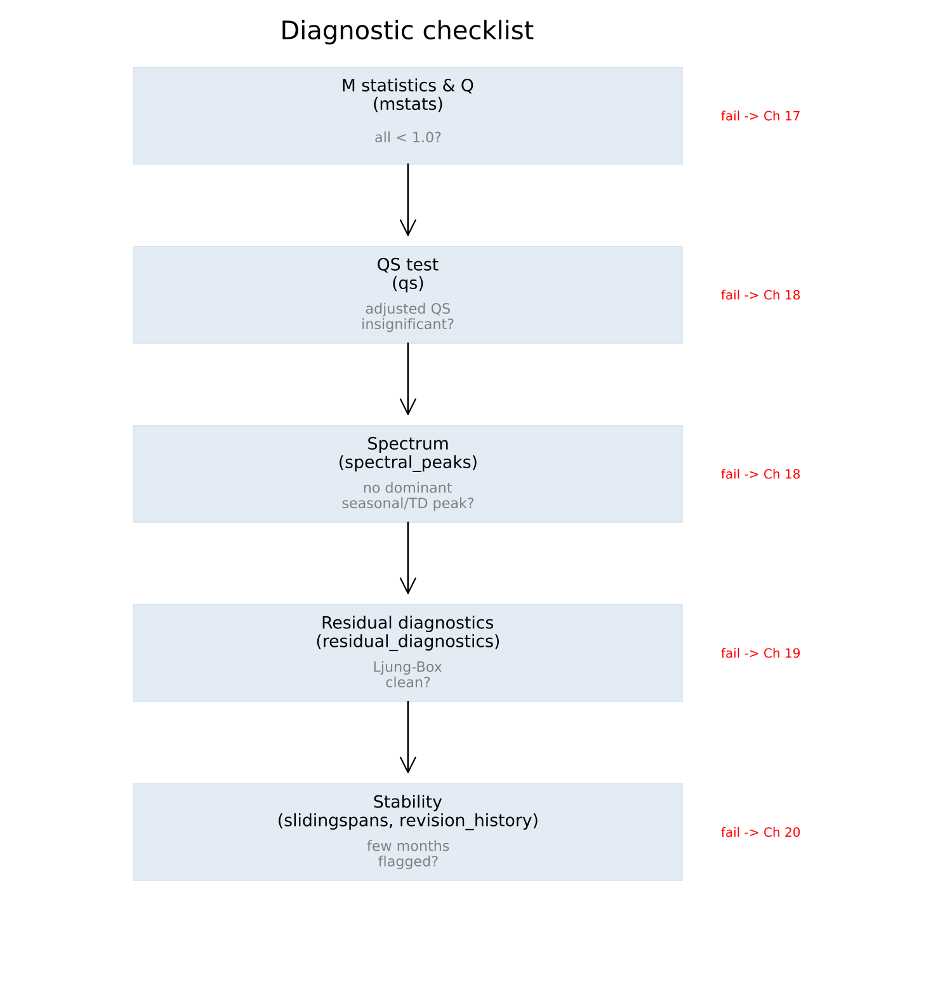

# A. A Diagnostic Checklist

No prose. Chapter 16's taxonomy in operational form — what to check,
which function, what value is wanted, and what to do should it fail.

| Check | Function | Want | If it fails |
|---|---|---|---|
| M statistics | [`mstats`](@ref) | all eleven below 1.0 | Chapter 17 — identify which family (level, trend, seasonal) is implicated |
| Q / Q2 | [`mstats`](@ref) | below 1.0 | Chapter 17 |
| QS (original) | [`qs`](@ref) | significant | confirms seasonality was present to remove |
| QS (adjusted) | [`qs`](@ref) | insignificant | Chapter 18 — but check the spectrum too before concluding the adjustment failed |
| Spectral peaks | [`spectral_peaks`](@ref), [`spectrum_peaks`](@ref) | no *dominant* seasonal or trading-day peak | Chapter 18 — look for a missing calendar regressor |
| Stable/moving seasonality F-tests | [`seasonality_tests`](@ref) | identifiable seasonality confirmed | Chapter 18 |
| Ljung-Box | [`residual_diagnostics`](@ref) | no significant lags | Chapter 19 — usually a missing regressor, not a wrong ARIMA order |
| Residual skewness/kurtosis/DW | [`residual_diagnostics`](@ref) | close to 0 / 3 / 2 | Chapter 19 |
| Sliding spans | [`slidingspans`](@ref) | low percentage of months flagged | Chapter 20 — consider a longer seasonal filter or a frozen spec |
| Revision history | [`revision_history`](@ref) | small average absolute revision | Chapter 20 |

**None of these is a certificate on its own** — Chapter 16's whole
argument is that the battery exists precisely because no single test,
and no single pass, can be. Several should be read together, and they
should be expected to disagree occasionally.

---

**See also:** Chapter 16 for why this checklist has this many rows.
